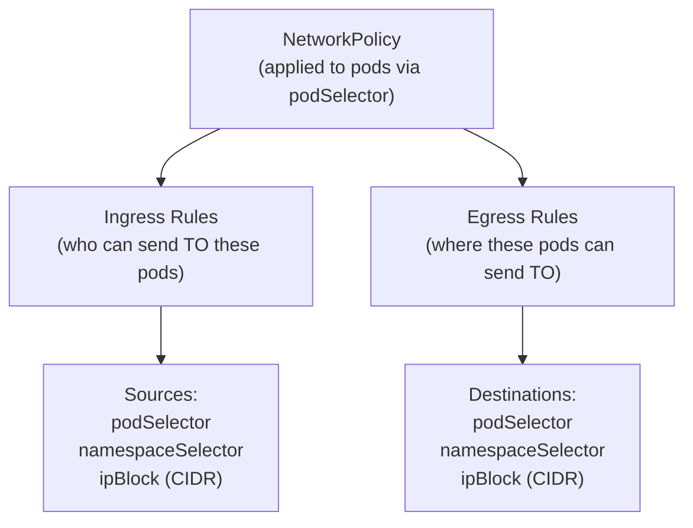

# 15.2 Network Policies — Microsegmentation

⏱️ **6 min read · 8 min hands-on** · 🔴 Advanced

> **TL;DR:** By default, every pod in a Kubernetes cluster can talk to every other pod — there are no network firewalls between them. **Network Policies** are Kubernetes-native firewall rules that restrict which pods can talk to which, on which ports. The golden rule for production: **default-deny all traffic, then explicitly allow only what's needed.**

> **After this section you will be able to:**
> - Implement zero-trust network isolation using Kubernetes `NetworkPolicy` resources
> - Write Ingress and Egress traffic filtering rules using pod selectors, namespace selectors, and CIDR blocks
> - Test and verify default-deny network policies with interactive debug containers

---

## The Problem: Flat Network by Default

```
Without Network Policies:

  [frontend pod] ←──────────────→ [database pod]   ✓ (allowed)
  [redis pod]    ←──────────────→ [database pod]   ✓ (allowed)
  [attacker pod] ←──────────────→ [database pod]   ✓ (ALSO allowed!)

Any compromised pod can freely reach any other pod or service.
```

```
With Network Policies (default-deny + allow-list):

  [frontend pod] ──────────────→ [database pod]    ✓ (explicitly allowed)
  [redis pod]    ──────────────→ [database pod]    ✗ (no matching allow rule)
  [attacker pod] ──────────────→ [database pod]    ✗ (blocked)
```

---

## How Network Policies Work



> **CNI Requirement:** Network Policies require a CNI plugin that enforces them — **Calico**, **Cilium**, or **Weave**. The default Minikube CNI (kindnet) does **not** enforce Network Policies. Use `minikube start --cni=calico`.

---

## Network Policy Structure

```yaml
apiVersion: networking.k8s.io/v1
kind: NetworkPolicy
metadata:
  name: db-policy
  namespace: production
spec:
  podSelector:            # Which pods this policy APPLIES TO
    matchLabels:
      app: postgres
  
  policyTypes:
  - Ingress               # Control incoming traffic
  - Egress                # Control outgoing traffic
  
  ingress:
  - from:                 # Allow FROM these sources
    - podSelector:        # Pods with this label (in same namespace)
        matchLabels:
          app: backend
    - namespaceSelector:  # Pods in namespaces with this label
        matchLabels:
          env: production
    ports:                # Only on these ports
    - protocol: TCP
      port: 5432
  
  egress:
  - to:
    - podSelector:
        matchLabels:
          app: redis
    ports:
    - protocol: TCP
      port: 6379
```

---

## The Three Selectors

| Selector | Matches | Example |
|----------|---------|---------|
| `podSelector` | Pods by label (within same namespace) | `app: backend` |
| `namespaceSelector` | All pods in namespaces matching label | `env: production` |
| `ipBlock` | External CIDR ranges | `10.0.0.0/8` (exclude `10.96.0.0/12`) |

### AND vs OR Logic

```yaml
# AND: must match BOTH selectors (same array item)
- from:
  - podSelector:
      matchLabels: {app: backend}
    namespaceSelector:       # ← same item as podSelector = AND
      matchLabels: {env: prod}
# Means: pods with app=backend AND in namespace with env=prod

# OR: either selector is sufficient (separate array items)
- from:
  - podSelector:
      matchLabels: {app: backend}   # ← separate item = OR
  - namespaceSelector:
      matchLabels: {env: prod}
# Means: pods with app=backend OR any pod in env=prod namespace
```

---

## Essential Patterns

### Pattern 1: Default Deny All (Start Here)

Always create this first in every application namespace:

```yaml
# Deny ALL ingress and egress by default
apiVersion: networking.k8s.io/v1
kind: NetworkPolicy
metadata:
  name: default-deny-all
  namespace: production
spec:
  podSelector: {}       # {} = matches ALL pods in namespace
  policyTypes:
  - Ingress
  - Egress
```

> After applying this, **nothing** can talk to anything. Then add allow policies layer by layer.

### Pattern 2: Allow DNS (Essential After Default Deny)

All pods need DNS resolution. Without this, no pod can resolve service names:

```yaml
apiVersion: networking.k8s.io/v1
kind: NetworkPolicy
metadata:
  name: allow-dns-egress
  namespace: production
spec:
  podSelector: {}
  policyTypes:
  - Egress
  egress:
  - to:
    - namespaceSelector:
        matchLabels:
          kubernetes.io/metadata.name: kube-system
    ports:
    - protocol: UDP
      port: 53
    - protocol: TCP
      port: 53
```

### Pattern 3: Frontend → Backend → Database

```yaml
# Allow frontend to reach backend on port 8080
apiVersion: networking.k8s.io/v1
kind: NetworkPolicy
metadata:
  name: allow-frontend-to-backend
  namespace: production
spec:
  podSelector:
    matchLabels:
      app: backend
  policyTypes:
  - Ingress
  ingress:
  - from:
    - podSelector:
        matchLabels:
          app: frontend
    ports:
    - protocol: TCP
      port: 8080
---

# Allow backend to reach database on port 5432
apiVersion: networking.k8s.io/v1
kind: NetworkPolicy
metadata:
  name: allow-backend-to-db
  namespace: production
spec:
  podSelector:
    matchLabels:
      app: postgres
  policyTypes:
  - Ingress
  ingress:
  - from:
    - podSelector:
        matchLabels:
          app: backend
    ports:
    - protocol: TCP
      port: 5432
```

### Pattern 4: Allow Monitoring to Scrape All Pods

```yaml
apiVersion: networking.k8s.io/v1
kind: NetworkPolicy
metadata:
  name: allow-prometheus-scrape
  namespace: production
spec:
  podSelector: {}        # All pods in namespace
  policyTypes:
  - Ingress
  ingress:
  - from:
    - namespaceSelector:
        matchLabels:
          kubernetes.io/metadata.name: monitoring
      podSelector:
        matchLabels:
          app: prometheus
    ports:
    - protocol: TCP
      port: 9090
    - protocol: TCP
      port: 8080
```

### Pattern 5: Namespace Isolation

All pods in namespace A can talk to each other, but not to namespace B:

```yaml
# Label your namespace first:
# kubectl label namespace team-a team=a
apiVersion: networking.k8s.io/v1
kind: NetworkPolicy
metadata:
  name: namespace-isolation
  namespace: team-a
spec:
  podSelector: {}
  policyTypes:
  - Ingress
  ingress:
  - from:
    - namespaceSelector:
        matchLabels:
          team: a         # Only allow traffic from same namespace
```

---

## Testing Network Policies

```bash
# Test connectivity between pods
kubectl run test-pod --image=busybox:1.36 --restart=Never -n production -- sleep 3600

# Test if frontend can reach backend (should succeed)
kubectl exec -n production test-pod -- wget -O- http://backend:8080 --timeout=3

# Test if test-pod can reach database (should be blocked)
kubectl exec -n production test-pod -- wget -O- http://postgres:5432 --timeout=3
# Expected: wget: can't connect to remote host (10.x.x.x): Connection timed out

# Check policies in a namespace
kubectl get networkpolicies -n production
kubectl describe networkpolicy default-deny-all -n production
```

---

## ✅ Quick Check

**Q1:** You apply `default-deny-all` to your namespace. Immediately your pods stop being able to resolve `my-service` by DNS. What policy do you need to add?

<details>
<summary>Answer</summary>
An **egress allow rule for DNS** on port 53 (UDP and TCP) targeting the `kube-system` namespace where CoreDNS runs. Without it, all DNS resolution fails because the `default-deny-all` policy also blocks egress. This is the most common mistake when first applying default-deny — always add the DNS egress allow immediately after.
</details>

**Q2:** You have two rules in a `from` block: one `podSelector` and one `namespaceSelector` as separate list items (not nested together). What logic applies?

<details>
<summary>Answer</summary>
**OR logic** — traffic is allowed if it matches EITHER the `podSelector` OR the `namespaceSelector`. To get AND logic (pod with that label AND in that namespace), you must nest both selectors within the **same list item** (as a single `from` entry with both fields on the same object). This is one of the most confusing parts of Network Policy syntax.
</details>

**Q3:** Does a Network Policy on the *destination* pod control traffic, or does the *source* pod's network policy control it?

<details>
<summary>Answer</summary>
Both ends independently — but typically it's the **destination pod's ingress policy** that controls who can reach it, and the **source pod's egress policy** that controls where it can connect to. For traffic to succeed, the egress policy on the source AND the ingress policy on the destination must both permit it. If either blocks it, the connection fails. This "both ends" model is what makes default-deny effective — even if a source has permissive egress, a restrictive destination ingress can still block it.
</details>
