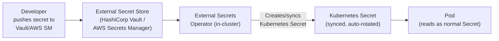

# 15.3 Secrets Management — Encryption and External Vaults

⏱️ **~7 min read**

> **TL;DR:** Kubernetes Secrets are **base64-encoded, not encrypted** by default — anyone with etcd access reads them as plaintext. The two defences: **Encryption at Rest** (encrypt Secrets in etcd using a KMS provider) and **External Secret Stores** (HashiCorp Vault, AWS Secrets Manager, Azure Key Vault) so the actual secret value never touches etcd at all.

---

## The Secrets Problem

```bash
# What a Secret actually looks like in etcd (without encryption at rest)
# base64 is NOT encryption:
echo "bXktc3VwZXItc2VjcmV0LXBhc3N3b3Jk" | base64 -d
# Output: my-super-secret-password
```

Anyone who can:
- Read etcd directly (`etcdctl get /registry/secrets/...`)
- Call `kubectl get secret my-secret -o yaml`
- Access the node's filesystem where secrets are mounted
- Read environment variables of a running process (`/proc/PID/environ`)

...can access your plaintext secret values.

---

## Layer 1: RBAC on Secrets

The first line of defence is access control — minimize who can read Secrets:

```yaml
# Never grant wildcard secret access
# ❌ Bad — grants access to ALL secrets
rules:
- apiGroups: [""]
  resources: ["secrets"]
  verbs: ["get", "list", "watch"]

# ✅ Good — grant access only to a named secret
rules:
- apiGroups: [""]
  resources: ["secrets"]
  resourceNames: ["my-app-db-credentials"]  # Specific secret only
  verbs: ["get"]
```

```bash
# Audit who can read secrets in a namespace
kubectl auth can-i get secrets -n production --as system:serviceaccount:production:default
kubectl auth can-i list secrets -n production --as developer-user

# View who has RBAC access to secrets
kubectl get rolebindings,clusterrolebindings -A -o json | \
  jq '.items[] | select(.roleRef.name | test("secret|admin")) | .metadata.name'
```

---

## Layer 2: Encryption at Rest

Enable encryption of Secrets (and other sensitive resources) in etcd. Requires access to the API server config:

```yaml
# /etc/kubernetes/encryption-config.yaml (on control-plane node)
apiVersion: apiserver.config.k8s.io/v1
kind: EncryptionConfiguration
resources:
- resources:
  - secrets
  - configmaps        # Optional: also encrypt ConfigMaps
  providers:
  # AES-GCM with a 32-byte key (generate: head -c 32 /dev/urandom | base64)
  - aescbc:
      keys:
      - name: key1
        secret: <base64-encoded-32-byte-key>
  # Fallback: identity = no encryption (for reading old unencrypted data)
  - identity: {}
```

```bash
# Enable on kube-apiserver (add to /etc/kubernetes/manifests/kube-apiserver.yaml):
# --encryption-provider-config=/etc/kubernetes/encryption-config.yaml

# Verify encryption is active (after enabling):
# Write a new secret
kubectl create secret generic test-encryption \
  --from-literal=key=supersecret -n default

# Check etcd directly — should show encrypted bytes, not plaintext
ETCDCTL_API=3 etcdctl get /registry/secrets/default/test-encryption \
  --endpoints=https://127.0.0.1:2379 \
  --cacert=/etc/kubernetes/pki/etcd/ca.crt \
  --cert=/etc/kubernetes/pki/etcd/server.crt \
  --key=/etc/kubernetes/pki/etcd/server.key | hexdump -C | head
# Should see "k8s:enc:aescbc:v1:key1:..." prefix — encrypted!
```

> **On managed clouds:** GKE, EKS, and AKS all support KMS-based encryption at rest via their managed key services (Cloud KMS, AWS KMS, Azure Key Vault). Enable it in the cluster settings — it's usually a checkbox.

---

## Layer 3: External Secret Stores (The Gold Standard)

With external secrets, the actual secret value **never enters etcd**. The workflow:



### External Secrets Operator (ESO)

ESO is the most popular solution — it watches `ExternalSecret` CRDs and syncs values from external stores into native Kubernetes Secrets:

```bash
# Install ESO via Helm
helm repo add external-secrets https://charts.external-secrets.io
helm install external-secrets external-secrets/external-secrets \
  --namespace external-secrets --create-namespace
```

```yaml
# Configure a SecretStore (points to the secret backend)
apiVersion: external-secrets.io/v1beta1
kind: SecretStore
metadata:
  name: vault-backend
  namespace: production
spec:
  provider:
    vault:
      server: "https://vault.example.com"
      path: "secret"
      version: "v2"
      auth:
        kubernetes:
          mountPath: "kubernetes"
          role: "my-app-role"
---
# ExternalSecret: which keys to fetch and how to map them
apiVersion: external-secrets.io/v1beta1
kind: ExternalSecret
metadata:
  name: db-credentials
  namespace: production
spec:
  refreshInterval: 1h          # Re-sync every hour (auto-rotation!)
  secretStoreRef:
    name: vault-backend
    kind: SecretStore
  target:
    name: db-credentials       # Name of the resulting Kubernetes Secret
    creationPolicy: Owner
  data:
  - secretKey: username        # Key in the K8s Secret
    remoteRef:
      key: production/db       # Path in Vault
      property: username       # Field within that Vault secret
  - secretKey: password
    remoteRef:
      key: production/db
      property: password
```

The resulting `db-credentials` Secret is a standard Kubernetes Secret — pods reference it exactly as they would any other secret. The magic is that ESO keeps it **automatically rotated** when the Vault value changes.

---

## Layer 4: Runtime Secret Hygiene

Even with external stores, runtime hygiene matters:

```yaml
# ❌ Bad: secret as environment variable (visible in ps, /proc/PID/environ)
env:
- name: DB_PASSWORD
  valueFrom:
    secretKeyRef:
      name: db-creds
      key: password

# ✅ Better: mount as file (only accessible to the process, not leaked to env)
volumes:
- name: db-creds
  secret:
    secretName: db-creds
    defaultMode: 0400    # Read-only for owner only (chmod 400)
volumeMounts:
- name: db-creds
  mountPath: /etc/secrets
  readOnly: true
# App reads /etc/secrets/password at startup — not in env
```

Additional runtime hardening:

```yaml
# Prevent secret values from appearing in pod spec (use secretKeyRef, not literals)
# Use imagePullSecrets for registry auth (never hardcode in Dockerfile)
# Set automountServiceAccountToken: false if the pod doesn't call the K8s API
spec:
  automountServiceAccountToken: false
```

---

## Secret Rotation Strategy

| Approach | Rotation Trigger | Downtime? |
|----------|-----------------|-----------|
| Manual update | Human runs `kubectl create secret --dry-run | kubectl apply` | Rolling restart needed |
| External Secrets Operator | `refreshInterval` + app reads file on each request | Zero (file-mounted secrets update in-place within ~1 min) |
| Vault Agent Sidecar | Vault lease expiry | Zero (sidecar refreshes the file; app rereads) |
| CSI Secret Store Driver | Mounted via CSI; updates when pod restarts | Restart needed (or live-reload if app watches file) |

---

## ✅ Quick Check

**Q1:** Someone asks: "Our Secrets are safe because they're base64 encoded." What do you say?

<details>
<summary>Answer</summary>
Base64 is **encoding, not encryption** — it's trivially reversible with `base64 -d`. Anyone with kubectl access to `get secret` or direct etcd access can instantly decode it. Kubernetes base64-encodes secrets purely for safe transport of binary data (not printable characters), not for security. Real protection requires RBAC (restrict who can `get secrets`), encryption at rest in etcd, and ideally external secret stores.
</details>

**Q2:** What is the main advantage of the External Secrets Operator over native Kubernetes Secrets?

<details>
<summary>Answer</summary>
The actual secret value lives in an external, purpose-built secret store (Vault, AWS Secrets Manager, etc.) that has: audit logging of every access, fine-grained access control, versioning, and automatic rotation. The Kubernetes Secret becomes a short-lived, auto-synced cache. If the K8s cluster is compromised and etcd is dumped, attackers get a value that may already be expired/rotated. Native secrets have no automatic rotation, and the value lives indefinitely in etcd.
</details>

**Q3:** A pod mounts a secret as a file at `/etc/secrets/api-key`. The ESO rotates the value in Vault. Does the pod need to restart to get the new value?

<details>
<summary>Answer</summary>
Not necessarily. Kubernetes **automatically updates mounted secret files** within roughly 1 minute of the underlying Secret object changing (controlled by `kubelet`'s `syncFrequency`). If the application **re-reads the file on each request** (or watches the file for changes), it picks up the new value without a restart. If the app reads the value only at startup and caches it in memory, it needs a restart to pick up the rotation. This is why file-based secrets are preferred over environment variables for rotation-friendly apps.
</details>
