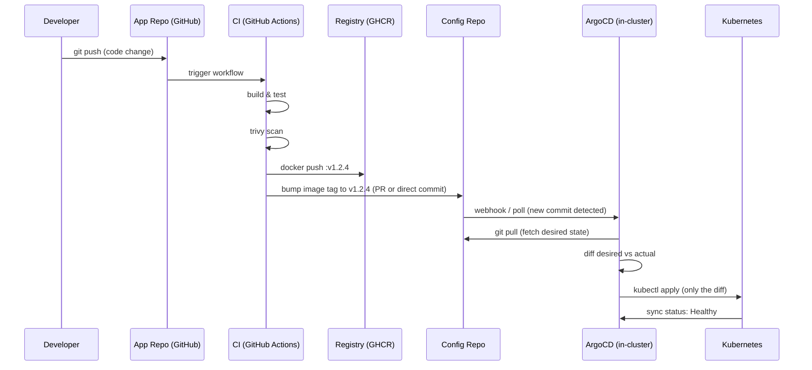

# 16.1 GitOps Principles — Git as the Source of Truth

⏱️ **~6 min read**

> **TL;DR:** GitOps means the **desired state of your cluster lives in Git**. A reconciliation loop inside the cluster continuously compares the desired state (Git) with the actual state (cluster) and corrects any drift — automatically. You never run `kubectl apply` manually in production. Everything goes through a pull request.

---

## Traditional CD vs GitOps

### Traditional Push-Based CD

```
Developer → git push → CI builds image → CI runs kubectl apply → Cluster
                                                     ↑
                           CI has cluster credentials with write access
                           → Single point of failure
                           → Audit trail: who ran what pipeline when?
                           → Cluster state might drift if someone runs kubectl manually
```

### GitOps Pull-Based CD

```
Developer → git push (to manifest repo) → Pull Request → Merge
                                                              ↓
                                          Git (Source of Truth)
                                                              ↓
                                       ┌─── ArgoCD/Flux (in-cluster) ───┐
                                       │  Watches Git, detects drift    │
                                       │  Pulls changes, applies them   │
                                       └────────────────────────────────┘
                                                              ↓
                                                         Cluster
```

The key shift: **the cluster pulls its state from Git** rather than CI pushing changes to the cluster. CI never needs `kubectl` access or kubeconfig credentials.

---

## The Four GitOps Principles (OpenGitOps)

| # | Principle | Meaning |
|---|-----------|---------|
| **1** | **Declarative** | Desired system state expressed as declarations (YAML), not imperative scripts |
| **2** | **Versioned & Immutable** | State stored in Git — every change has a commit, full history, rollback via `git revert` |
| **3** | **Pulled Automatically** | Software agents continuously observe and apply the desired state — not pushed from CI |
| **4** | **Continuously Reconciled** | If the cluster drifts from Git (someone runs `kubectl edit`), the agent corrects it |

---

## What Lives in Each Repository

GitOps typically uses **two repositories** (or a monorepo with two trees):

```
├── app-repo/                    ← Application Code Repository
│   ├── src/
│   ├── Dockerfile
│   ├── .github/workflows/
│   │   └── ci.yaml              ← Build, test, push image → update image tag in config-repo
│   └── tests/
│
└── config-repo/                 ← GitOps Configuration Repository (cluster desired state)
    ├── base/
    │   ├── deployment.yaml      ← image: my-app:v1.2.3  ← Only this changes on deploy
    │   ├── service.yaml
    │   └── kustomization.yaml
    ├── overlays/
    │   ├── dev/                 ← Dev-specific patches
    │   └── prod/                ← Prod-specific patches
    └── helm/
        └── my-app/values.yaml
```

> **Why two repos?** App code and cluster configuration change at different rates and need different review processes. A change to `deployment.yaml` should go through an infra review; a business logic change shouldn't block on it.

---

## The GitOps Workflow End-to-End



---

## GitOps vs Traditional CD — Comparison

| Concern | Traditional Push CD | GitOps Pull CD |
|---------|--------------------|--------------:|
| **Cluster credentials in CI** | Yes — CI needs kubeconfig | No — agent inside cluster pulls |
| **Audit trail** | CI logs (limited) | Git commit history (complete) |
| **Rollback** | Re-run old pipeline or `kubectl rollout undo` | `git revert` → auto-applied |
| **Drift detection** | None | Continuous (agent reconciles every N min) |
| **Multi-cluster** | Complex; separate pipeline per cluster | Simple; each cluster runs its own agent |
| **Approval workflow** | Bespoke per CI system | Pull Requests — standard Git workflow |
| **Disaster recovery** | Rebuild from pipeline | Apply config-repo to new cluster |

---

## Kustomize vs Helm in GitOps

Both work well in GitOps. Choose based on team familiarity:

| | Kustomize | Helm |
|--|-----------|------|
| **Built into kubectl** | Yes (`kubectl apply -k`) | No (separate binary) |
| **Templating** | Patch-based (overlays on base YAML) | Full Go templates |
| **Config-repo** | `kustomization.yaml` per environment | `values.yaml` per environment |
| **Learning curve** | Low | Medium |
| **Best for** | Simple env-specific patches | Complex apps with many configurable knobs |

---

## ✅ Quick Check

**Q1:** In GitOps, why doesn't the CI pipeline need `kubectl` access to the production cluster?

<details>
<summary>Answer</summary>
Because GitOps uses a **pull model** — the CI pipeline only needs to push an image to the registry and update an image tag in the config repo. An **agent running inside the cluster** (ArgoCD, Flux) watches the config repo and applies changes itself. The agent has in-cluster RBAC permissions — no credentials need to leave the cluster. This eliminates a major attack surface: a compromised CI system can no longer directly `kubectl apply` malicious workloads.
</details>

**Q2:** A developer edits a Deployment directly in the cluster using `kubectl edit`. What happens in a GitOps system?

<details>
<summary>Answer</summary>
The GitOps agent (ArgoCD/Flux) detects **drift** — the cluster's actual state no longer matches the Git-declared desired state. Depending on configuration: with **auto-sync** enabled, the agent reverts the manual edit on the next reconciliation cycle (typically within minutes). With **manual sync**, the ArgoCD UI/CLI shows the Application as "OutOfSync" and an operator must confirm the sync. Either way, the git-declared state wins.
</details>

**Q3:** What is the advantage of using `git revert` for rollbacks over `kubectl rollout undo`?

<details>
<summary>Answer</summary>
`kubectl rollout undo` only reverts the Deployment's pod template — it doesn't update ConfigMaps, Services, Ingress rules, or any other resources that may have changed in the same release. `git revert` creates a new commit that undoes **all changes** in that release (the entire manifest set), and the GitOps agent applies the complete rollback atomically. It also leaves a clear audit trail in Git showing who rolled back, why, and when.
</details>
