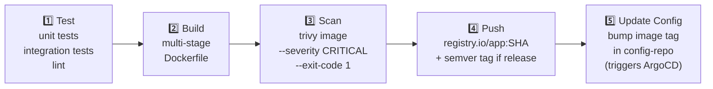

# 16.2 Container Image CI Pipeline

⏱️ **6 min read · 7 min hands-on** · 🔴 Advanced

> **TL;DR:** A solid container image CI pipeline has five stages: **Test** (unit + integration tests), **Build** (multi-stage Docker build), **Scan** (Trivy for CVEs), **Push** (to registry with immutable tag), and **Update** (bump the image tag in the config repo to trigger GitOps CD). The tag should always be the git commit SHA — never `latest`.

> **After this section you will be able to:**
> - Build multi-stage production Dockerfiles optimized for minimal attack surface and size
> - Automate container image builds, vulnerability scans, and registry pushes in CI
> - Generate immutable git commit SHA tags and update manifest repositories automatically

---

## Why `latest` Is Dangerous in CI/CD

```bash
# ❌ Bad — non-reproducible, ambiguous
docker push my-app:latest

# ✓ Good — immutable, traceable to a specific commit
docker push my-app:v1.3.2
docker push my-app:sha-a3f8c1d         # Git SHA
docker push my-app:sha-a3f8c1d@sha256:abc...  # Content digest (most secure)
```

With `latest` you can't tell which code version is running in production, can't do targeted rollbacks, and cache invalidation becomes non-deterministic.

---

## The Five-Stage Pipeline



---

## Complete GitHub Actions Workflow

<details>
<summary>📦 <b>Full Production GitHub Actions Workflow (click to expand)</b></summary>

```yaml
# .github/workflows/ci.yaml
name: CI — Build, Scan, Push

on:
  push:
    branches: [main]
  pull_request:
    branches: [main]

env:
  REGISTRY: ghcr.io
  IMAGE_NAME: ${{ github.repository }}

jobs:
  # ─── Stage 1: Test ────────────────────────────────────
  test:
    name: Unit & Integration Tests
    runs-on: ubuntu-latest
    steps:
    - uses: actions/checkout@v4

    - name: Set up Python
      uses: actions/setup-python@v5
      with:
        python-version: "3.12"
        cache: "pip"

    - name: Install dependencies
      run: pip install -r requirements.txt -r requirements-dev.txt

    - name: Run tests
      run: pytest --cov=app --cov-report=xml

  # ─── Stage 2: Build ───────────────────────────────────
  build:
    name: Build & Scan Container Image
    needs: test
    runs-on: ubuntu-latest
    outputs:
      image-tag: ${{ steps.meta.outputs.tags }}
      image-digest: ${{ steps.build.outputs.digest }}
    steps:
    - uses: actions/checkout@v4

    - name: Set up Docker Buildx
      uses: docker/setup-buildx-action@v3

    - name: Log in to GitHub Container Registry
      uses: docker/login-action@v3
      with:
        registry: ${{ env.REGISTRY }}
        username: ${{ github.actor }}
        password: ${{ secrets.GITHUB_TOKEN }}

    - name: Extract metadata (tags, labels)
      id: meta
      uses: docker/metadata-action@v5
      with:
        images: ${{ env.REGISTRY }}/${{ env.IMAGE_NAME }}
        tags: |
          type=sha,prefix=sha-,format=short
          type=ref,event=branch
          type=semver,pattern={{version}}

    # ─── Stage 3: Scan with Trivy (before pushing) ────
    - name: Build image locally for scanning
      uses: docker/build-push-action@v5
      with:
        context: .
        load: true
        tags: local-test:${{ github.sha }}
        cache-from: type=gha
        cache-to: type=gha,mode=max

    - name: Scan with Trivy for CRITICAL CVEs
      uses: aquasecurity/trivy-action@master
      with:
        image-ref: local-test:${{ github.sha }}
        format: table
        exit-code: 1          # Fail the build if CRITICAL CVE found
        ignore-unfixed: true   # Only fail for CVEs that have a fix available
        severity: CRITICAL,HIGH

    # ─── Stage 4: Push to Registry ─────────────────────
    - name: Build and push to registry
      id: build
      uses: docker/build-push-action@v5
      with:
        context: .
        push: ${{ github.ref == 'refs/heads/main' }}  # Only push on main branch
        tags: ${{ steps.meta.outputs.tags }}
        labels: ${{ steps.meta.outputs.labels }}
        cache-from: type=gha
        cache-to: type=gha,mode=max

  # ─── Stage 5: Update Config Repo (GitOps Trigger) ────
  update-manifest:
    name: Update GitOps Config Repository
    needs: build
    if: github.ref == 'refs/heads/main'
    runs-on: ubuntu-latest
    steps:
    - name: Check out config repository
      uses: actions/checkout@v4
      with:
        repository: myorg/k8s-manifests    # The GitOps repo
        token: ${{ secrets.GITOPS_REPO_PAT }}
        path: config-repo

    - name: Update image tag with Kustomize
      working-directory: config-repo/apps/my-app/overlays/production
      run: |
        NEW_TAG="sha-$(echo ${{ github.sha }} | cut -c1-7)"
        
        # Using Kustomize (recommended):
        kustomize edit set image \
          ghcr.io/myorg/my-app=ghcr.io/myorg/my-app:${NEW_TAG}
        
        # Or for raw YAML with yq:
        # yq e -i '.spec.template.spec.containers[0].image = "ghcr.io/myorg/my-app:'${NEW_TAG}'"' \
        #   base/deployment.yaml

    - name: Commit and push
      run: |
        cd config-repo
        git config user.name "ci-bot"
        git config user.email "ci-bot@example.com"
        git add .
        git diff --staged --quiet || git commit -m \
          "ci: update my-app to sha-$(echo ${{ github.sha }} | cut -c1-7)

          Triggered by: ${{ github.actor }}
          Commit: ${{ github.sha }}
          Run: ${{ github.server_url }}/${{ github.repository }}/actions/runs/${{ github.run_id }}"
        git push
```

</details>

---

## Key Pipeline Decisions

### Tag Strategy

| Tag Type | When to Use | Example |
|----------|-------------|---------|
| `sha-<short>` | Every main branch push | `sha-a3f8c1d` |
| `v<semver>` | On git tags/releases | `v1.3.2` |
| `main-<date>-<sha>` | Nightly builds | `main-20240115-a3f8c1d` |
| `pr-<number>` | PR builds (for preview envs) | `pr-142` |

> **Never use `latest` in a production deployment manifest.** If the registry has a network hiccup during a rollout, Kubernetes might pull a cached `latest` that's a different version than intended.

### Build Caching

```yaml
# Layer caching dramatically reduces build times:
cache-from: type=gha           # GitHub Actions cache
cache-from: type=registry,ref=ghcr.io/myorg/my-app:buildcache
cache-to: type=registry,ref=ghcr.io/myorg/my-app:buildcache,mode=max
```

### Multi-Architecture Builds

```yaml
- name: Set up QEMU (for cross-compilation)
  uses: docker/setup-qemu-action@v3

- name: Build multi-arch
  uses: docker/build-push-action@v5
  with:
    platforms: linux/amd64,linux/arm64   # For Apple Silicon + cloud
    push: true
    tags: ${{ steps.meta.outputs.tags }}
```

---

## ✅ Quick Check

**Q1:** Why should CI fail (exit code 1) on CRITICAL CVEs found by Trivy, rather than just reporting them?

<details>
<summary>Answer</summary>
If the pipeline only reports CVEs without failing, developers will notice them in logs but face no pressure to fix them — the image gets pushed and deployed anyway. Making the pipeline fail on CRITICAL CVEs creates a hard gate: a vulnerable image **cannot reach production**. The team is forced to either fix the dependency, update the base image, or explicitly acknowledge and accept the risk via a documented exception. Soft warnings get ignored; hard failures get fixed.
</details>

**Q2:** The CI pipeline pushes an image tagged `sha-a3f8c1d` and commits the updated tag to the config repo. It doesn't directly run `kubectl apply`. How does the cluster get updated?

<details>
<summary>Answer</summary>
The config repo commit is detected by the GitOps agent (ArgoCD or Flux) running inside the cluster, which continuously watches the repo. It pulls the new commit, sees the image tag changed from `sha-prev123` to `sha-a3f8c1d`, and applies the diff to the cluster — triggering a Deployment rollout. No CI credentials or kubectl access to the cluster are needed — the agent's in-cluster service account does the apply.
</details>

**Q3:** Your Dockerfile has 8 layers. On a typical push, only 1 layer (your app code) changes. Without build caching, every layer rebuilds from scratch. With GitHub Actions cache, what's the expected time saving?

<details>
<summary>Answer</summary>
The cached layers (typically: base image, OS package installs, dependency installs) are pulled from cache rather than rebuilt — often reducing build time by 60-90%. For example, `pip install -r requirements.txt` for a large Python app might take 3-5 minutes; with caching it takes ~5 seconds (just a cache hit). Only the changed layer and all layers after it need rebuilding. This is why proper layer ordering matters: put slow-changing layers (OS, deps) before fast-changing ones (your app code).
</details>
