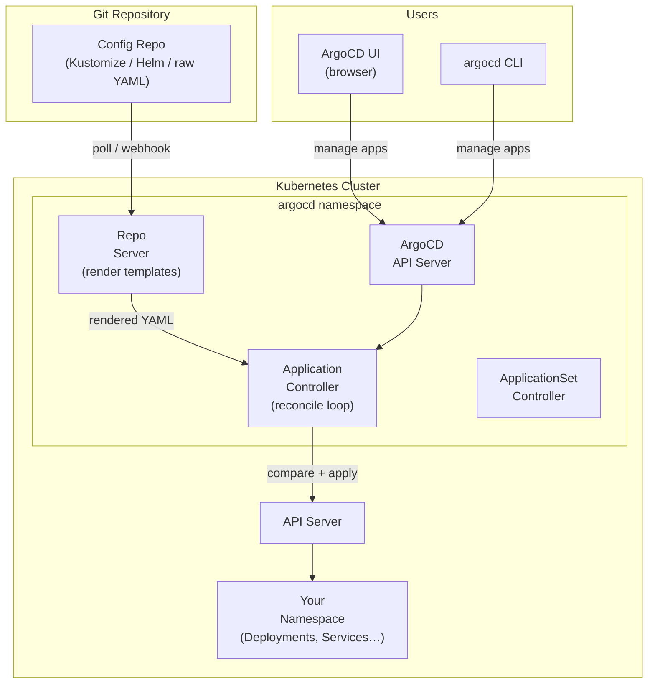

# 16.4 ArgoCD — Declarative CD for Kubernetes

⏱️ **6 min read · 8 min hands-on** · 🔴 Advanced

> **TL;DR:** ArgoCD is a GitOps continuous delivery controller that runs inside your cluster. It watches a Git repository, compares the desired state (Git) with the actual state (cluster), and automatically syncs the difference. Every deployment, rollback, and status check goes through ArgoCD's UI or CLI — `kubectl apply` in production becomes a thing of the past.

> **After this section you will be able to:**
> - Deploy and configure the ArgoCD GitOps engine in Kubernetes
> - Create declarative ArgoCD `Application` and `ApplicationSet` resources watching Git repositories
> - Manage automatic synchronization, self-healing, and visual health rollouts

---

## ArgoCD Architecture



---

## Core Concepts

| Concept | Description |
|---------|-------------|
| **Application** | An ArgoCD CRD that maps a Git repo path to a cluster namespace |
| **AppProject** | Groups Applications; defines RBAC and source/destination restrictions |
| **Sync** | The act of applying the Git state to the cluster |
| **Sync Status** | `Synced` / `OutOfSync` — does Git match the cluster? |
| **Health Status** | `Healthy` / `Degraded` / `Progressing` — are cluster resources working? |
| **Auto-Sync** | Automatically apply Git changes without manual approval |
| **Self-Heal** | Revert manual cluster changes back to Git state |

---

## Installing ArgoCD

```bash
# Create namespace and install
kubectl create namespace argocd
kubectl apply -n argocd -f \
  https://raw.githubusercontent.com/argoproj/argo-cd/stable/manifests/install.yaml

# Wait for all pods to be Running
kubectl rollout status deployment/argocd-server -n argocd
kubectl get pods -n argocd

# Get the initial admin password
kubectl get secret argocd-initial-admin-secret -n argocd \
  -o jsonpath="{.data.password}" | base64 -d && echo

# Port-forward the ArgoCD UI
kubectl port-forward svc/argocd-server -n argocd 8080:443

# Or install the argocd CLI
curl -sSL -o argocd \
  https://github.com/argoproj/argo-cd/releases/latest/download/argocd-linux-amd64
chmod +x argocd && sudo mv argocd /usr/local/bin/

# Login via CLI
argocd login localhost:8080 \
  --username admin \
  --password $(kubectl get secret argocd-initial-admin-secret -n argocd \
    -o jsonpath="{.data.password}" | base64 -d) \
  --insecure
```

---

## Defining an Application

An `Application` CRD is the core ArgoCD object. It says: "track this Git path and apply it to this cluster/namespace."

### Kustomize Application

```yaml
apiVersion: argoproj.io/v1alpha1
kind: Application
metadata:
  name: my-app-production
  namespace: argocd
  finalizers:
  - resources-finalizer.argocd.argoproj.io   # Clean up resources on deletion
spec:
  project: default

  source:
    repoURL: https://github.com/myorg/k8s-config.git
    targetRevision: HEAD                       # Branch, tag, or commit SHA
    path: overlays/production                  # Path within the repo

  destination:
    server: https://kubernetes.default.svc    # In-cluster (same cluster ArgoCD is in)
    namespace: production

  syncPolicy:
    automated:                                 # Auto-sync on Git changes
      prune: true                              # Delete resources removed from Git
      selfHeal: true                           # Revert manual cluster changes
    syncOptions:
    - CreateNamespace=true                     # Create namespace if missing
    - PrunePropagationPolicy=foreground        # Wait for resources to be deleted
    retry:
      limit: 5
      backoff:
        duration: 5s
        factor: 2
        maxDuration: 3m
```

### Helm Application

```yaml
apiVersion: argoproj.io/v1alpha1
kind: Application
metadata:
  name: monitoring
  namespace: argocd
spec:
  source:
    repoURL: https://prometheus-community.github.io/helm-charts
    chart: kube-prometheus-stack
    targetRevision: "55.5.0"                   # Pinned chart version
    helm:
      releaseName: monitoring
      values: |
        grafana:
          adminPassword: supersecret
        prometheus:
          prometheusSpec:
            retention: 7d
  destination:
    server: https://kubernetes.default.svc
    namespace: monitoring
  syncPolicy:
    automated:
      prune: true
      selfHeal: true
    syncOptions:
    - CreateNamespace=true
```

---

## ArgoCD CLI — Day-to-Day Operations

```bash
# List all applications
argocd app list

# Check app status
argocd app get my-app-production

# Manual sync (when auto-sync is off)
argocd app sync my-app-production

# Sync only a specific resource
argocd app sync my-app-production --resource Deployment:my-app

# Check what would change (diff, like helm diff)
argocd app diff my-app-production

# Roll back to a previous revision
argocd app history my-app-production        # List revisions
argocd app rollback my-app-production 3     # Roll back to revision 3

# Hard refresh (clear cache, re-fetch from Git)
argocd app get my-app-production --hard-refresh

# Delete an application (and its resources if finalizer is set)
argocd app delete my-app-production
```

---

## Sync Waves and Hooks — Controlling Deployment Order

For ordered deployments (e.g., run DB migrations before deploying app):

```yaml
# 1. Database migration Job runs first (wave -1)
apiVersion: batch/v1
kind: Job
metadata:
  name: db-migrate
  annotations:
    argocd.argoproj.io/sync-wave: "-1"    # Lower number = runs first
    argocd.argoproj.io/hook: PreSync      # Only run before sync
    argocd.argoproj.io/hook-delete-policy: HookSucceeded
spec:
  template:
    spec:
      containers:
      - name: migrate
        image: my-app:sha-a3f8c1d
        command: ["python", "manage.py", "migrate"]
      restartPolicy: Never
---

# 2. Application Deployment (wave 0, default)
apiVersion: apps/v1
kind: Deployment
metadata:
  name: my-app
  annotations:
    argocd.argoproj.io/sync-wave: "0"
```

| Hook | When It Runs |
|------|-------------|
| `PreSync` | Before any resources are applied |
| `Sync` | During the sync, alongside other resources |
| `PostSync` | After all resources are healthy |
| `SyncFail` | If sync fails (for cleanup/notification) |

---

## ApplicationSet — Multi-Cluster and Multi-Environment

`ApplicationSet` auto-generates `Application` objects from a template:

```yaml
apiVersion: argoproj.io/v1alpha1
kind: ApplicationSet
metadata:
  name: my-app-all-envs
  namespace: argocd
spec:
  generators:
  - list:
      elements:
      - env: dev
        cluster: https://dev-cluster:6443
        namespace: my-app-dev
        revision: main
        selfHeal: "true"
      - env: staging
        cluster: https://staging-cluster:6443
        namespace: my-app-staging
        revision: main
        selfHeal: "true"
      - env: production
        cluster: https://prod-cluster:6443
        namespace: my-app-prod
        revision: v1.2.3          # Prod is pinned to a release tag
        selfHeal: "false"         # Manual sync / no auto-heal for prod
  template:
    metadata:
      name: "my-app-{{env}}"
    spec:
      project: default
      source:
        repoURL: https://github.com/myorg/k8s-config.git
        targetRevision: "{{revision}}"
        path: "overlays/{{env}}"
      destination:
        server: "{{cluster}}"
        namespace: "{{namespace}}"
      syncPolicy:
        automated:
          prune: true
          selfHeal: "{{selfHeal}}" # selfHeal is a boolean — parameterized via generator elements
```

---

## ✅ Quick Check

**Q1:** What's the difference between `Synced` and `Healthy` in ArgoCD?

<details>
<summary>Answer</summary>
**Synced** means the cluster resources **match** what's declared in Git (the desired state). **Healthy** means those resources are **working correctly** — pods are Running, Deployments have the expected number of ready replicas, Services have endpoints, etc. An app can be `Synced` but `Degraded` (e.g., the manifest is correctly applied but pods are crash-looping). It can also be `OutOfSync` but `Healthy` (someone manually edited a ConfigMap — Git doesn't match, but everything still works).
</details>

**Q2:** You have `selfHeal: true` enabled. An on-call engineer adds a temporary environment variable to a Deployment using `kubectl edit` during an incident. What happens?

<details>
<summary>Answer</summary>
ArgoCD detects the drift within the next reconciliation cycle (default: every 3 minutes) and **reverts the manual change** — removing the env var. This is by design: in GitOps, Git is the single source of truth. For emergencies, the correct approach is to make the change in Git (fast PR or direct commit to a branch), let ArgoCD sync it, and revert when the incident is over. Some teams disable `selfHeal` for production to allow temporary manual overrides, at the cost of drift risk.
</details>

**Q3:** How does ArgoCD enable rolling back a deployment without running `kubectl rollout undo`?

<details>
<summary>Answer</summary>
ArgoCD tracks the Git revision history of the config repo. Each sync corresponds to a specific Git commit. To roll back, you use `argocd app rollback my-app REVISION` which instructs ArgoCD to sync to a previous commit's state, applying all the manifests from that commit — not just the Deployment template. This is more complete than `kubectl rollout undo` which only reverts the pod template spec, not ConfigMaps, Services, or other resources that may have changed.
</details>
