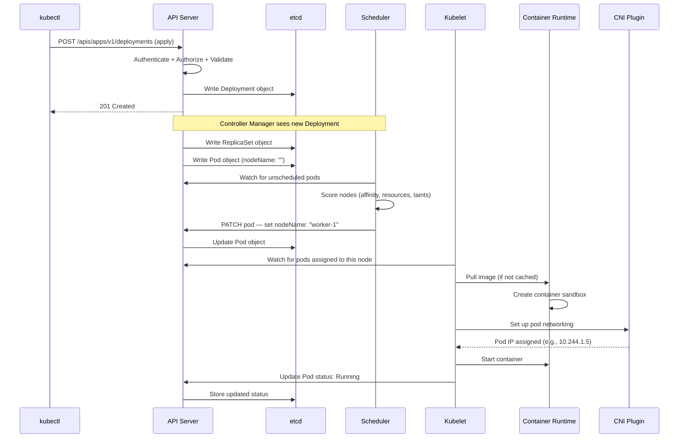

# 17.1 How a Pod Gets Created — The Full Journey

⏱️ **8 min read · 7 min hands-on** · 🔴 Advanced

> **TL;DR:** `kubectl apply` is just the start. A pod creation touches 6+ components across the control plane and the worker node before a single container runs. Here's every step.

> **After this section you will be able to:**
> - Trace every step of pod creation across API Server, etcd, Scheduler, Kubelet, and CRI
> - Understand the role of Admission Controllers (mutating and validating webhooks)
> - Inspect CRI pod sandboxes and pause containers directly using `crictl`

---

## The Cast of Characters

Before we trace the journey, here are the components involved:

| Component | Lives On | Role |
|---|---|---|
| `kubectl` | Your machine | Sends API requests |
| **API Server** | Control plane | The single entry point; validates and stores |
| **etcd** | Control plane | Persistent key-value store — the source of truth |
| **Scheduler** | Control plane | Decides *which node* a pod runs on |
| **Controller Manager** | Control plane | Watches state, reconciles differences |
| **Kubelet** | Worker node | Pulls images, starts containers, reports health |
| **Container Runtime** | Worker node | Actually runs the container (containerd, CRI-O) |
| **CNI Plugin** | Worker node | Wires up pod networking |

---

## The Full Journey



Let's walk through each phase in detail.

---

## Phase 1: API Server Receives the Request

When you run `kubectl apply -f deployment.yaml`, kubectl serializes the YAML to JSON and sends an HTTP `POST` or `PATCH` to the API server.

The API server runs the request through a chain of plugins before writing anything:

```
1. Authentication     → Who are you? (client cert, bearer token, OIDC)
2. Authorization      → Can you do this? (RBAC check)
3. Admission Control  → Should we allow this? (webhooks, defaults, limits)
4. Validation         → Is the object schema valid?
5. Persistence        → Write to etcd
```

> ⚠️ **Warning:** If any step fails, the entire request is rejected. Nothing is written to etcd. This is why an RBAC error or a ResourceQuota limit stops a deployment immediately at apply-time.

### Try It — Watch API Server Audit Logs

```bash
# Minikube exposes API server at localhost
kubectl get --raw /api/v1/namespaces/default/pods | python3 -m json.tool | head -40
```

---

## Phase 2: Deployment → ReplicaSet → Pod (Controller Manager)

The **Deployment Controller** (part of `kube-controller-manager`) watches the API server for Deployment objects. When it sees a new one:

1. It creates a **ReplicaSet** to manage the desired number of pods
2. The **ReplicaSet Controller** then creates bare **Pod objects** — but with `nodeName` left empty

```bash
# See the controller hierarchy yourself
kubectl get replicaset -o wide

# Each pod was "born" from a ReplicaSet
kubectl get pod <pod-name> -o yaml | grep ownerReferences -A 5
```

**Expected output:**
```
  ownerReferences:
  - apiVersion: apps/v1
    blockOwnerDeletion: true
    controller: true
    kind: ReplicaSet
    name: nginx-deployment-7d6d5f5c9
    uid: a1b2c3...
```

> 💡 **Tip:** Every K8s object knows its parent via `ownerReferences`. This is how garbage collection works — when you delete a Deployment, the cascade deletes ReplicaSets and Pods automatically.

---

## Phase 3: Scheduling — Where Does This Pod Live?

The **Scheduler** watches for pods that have `nodeName: ""` (no node assigned). When it finds one, it runs a two-phase algorithm:

### Filtering (Predicates)
Eliminates nodes that *cannot* run the pod:
- Does the node have enough CPU/memory?
- Does the node satisfy taints/tolerations?
- Does the pod have node affinity requirements?
- Are the required ports available?

### Scoring (Priorities)
Ranks the remaining nodes. Default factors:
- **LeastRequestedPriority** — prefer less-loaded nodes
- **BalancedResourceAllocation** — prefer balanced CPU/memory ratio
- **SelectorSpreadPriority** — spread pods of the same service across nodes

The winner gets the pod: the scheduler sends a `PATCH` request to the API server updating `pod.spec.nodeName`.

```bash
# See scheduling events live
kubectl describe pod <pod-name> | grep -A 5 "Events:"
```

**Expected output:**
```
Events:
  Type    Reason     Age   From               Message
  ----    ------     ----  ----               -------
  Normal  Scheduled  30s   default-scheduler  Successfully assigned default/nginx-xxx to minikube
  Normal  Pulling    29s   kubelet            Pulling image "nginx:1.25"
  Normal  Pulled     25s   kubelet            Successfully pulled image
  Normal  Created    25s   kubelet            Created container nginx
  Normal  Started    25s   kubelet            Started container nginx
```

> 📝 **Note:** The scheduler makes *one* decision per pod. It doesn't move pods after they're scheduled (that's the job of tools like Descheduler, a separate optional component).

---

## Phase 4: Kubelet — Making It Real

The **Kubelet** on each node watches the API server for pods assigned to *its* node. When it sees one:

```
1. Admit the pod (check node-local admission)
2. Fetch the image (pull from registry if not cached)
3. Create the pod sandbox (pause container — the network namespace holder)
4. Call CNI to set up networking
5. Start init containers (in order, wait for each to complete)
6. Start app containers
7. Start post-start lifecycle hooks
8. Begin probe management (liveness, readiness, startup)
9. Report pod status back to API server
```

### The "Pause" Container

Every pod has a hidden **pause** (or "infra") container you never see:

```bash
# SSH into minikube node and see the pause containers via CRI
minikube ssh
sudo crictl ps | grep pause
```

**Expected output:**
```
CONTAINER ID   IMAGE                                     CREATED         STATE     NAME    ATTEMPT   POD ID
sha256:abc123  registry.k8s.io/pause:3.9                 2 hours ago     Running   pause   0         k8s_POD_nginx-xxx_default
```

This `pause` container is the network namespace anchor. All other containers in the pod join its network namespace — that's how they share an IP and can reach each other on `localhost`.

---

## Phase 5: Status Feedback Loop

Once containers are running, the kubelet continuously:
- Runs health probes (liveness, readiness, startup)
- Updates `pod.status.conditions` via the API server
- Reports container restart counts
- Reflects container state (Running, Terminated, Waiting)

```bash
# Watch the status feedback in real-time
kubectl get pod <pod-name> -w
```

```
NAME        READY   STATUS              RESTARTS   AGE
nginx-xxx   0/1     Pending             0          0s
nginx-xxx   0/1     ContainerCreating   0          1s
nginx-xxx   1/1     Running             0          3s
```

This is eventually consistent — there's a brief lag between what etcd has and what `kubectl get` returns because the informer cache needs to sync.

---

## Key Takeaways

| # | Concept | One-liner |
|---|---|---|
| 1 | API Server is the only door | Every component talks to API server, never to each other directly |
| 2 | etcd is write-once truth | State is only real when it's written to etcd |
| 3 | Controllers are reconcilers | They watch state, detect drift, act to close the gap |
| 4 | Scheduler is one-shot | It picks a node once; it doesn't relocate running pods |
| 5 | Kubelet makes it physical | Everything above is just data; kubelet turns data into containers |

---

## ✅ Quick Check

**Q1:** You `kubectl apply` a Deployment with 3 replicas. How many objects does the Controller Manager write to etcd? (Hint: count carefully.)

<details>
<summary>Answer</summary>
At minimum 4 objects: 1 ReplicaSet + 3 Pod objects. The Deployment object itself was written by your apply. So the Controller Manager writes a ReplicaSet + 3 Pods = 4 additional objects.
</details>

**Q2:** A pod stays in `Pending` state for 5 minutes. What's the most likely cause, and which component is "stuck"?

<details>
<summary>Answer</summary>
The Scheduler can't find a node that satisfies the pod's requirements. Either resources are exhausted, there are unsatisfiable node affinity rules, or a taint is blocking placement. The Scheduler is stuck in the filtering phase. Check `kubectl describe pod` → Events for the reason.
</details>

**Q3:** If the API server crashes while a pod is already Running, what happens to the running pod?

<details>
<summary>Answer</summary>
The pod keeps running! The kubelet manages container state locally and doesn't need the API server for already-running workloads. The pod only stops if the node itself fails, or when the kubelet explicitly kills it. However, you won't be able to see pod status or issue new commands until the API server recovers.
</details>
