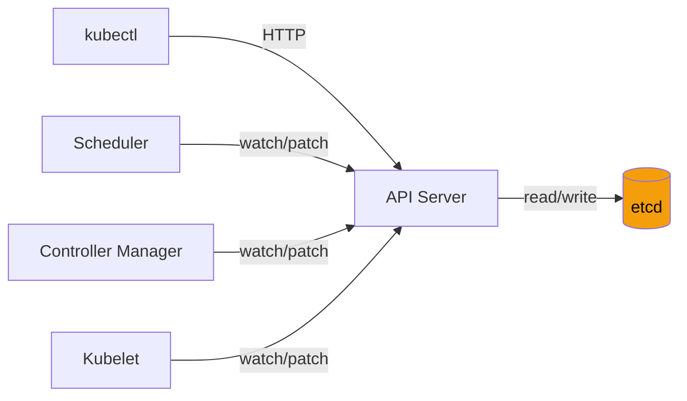
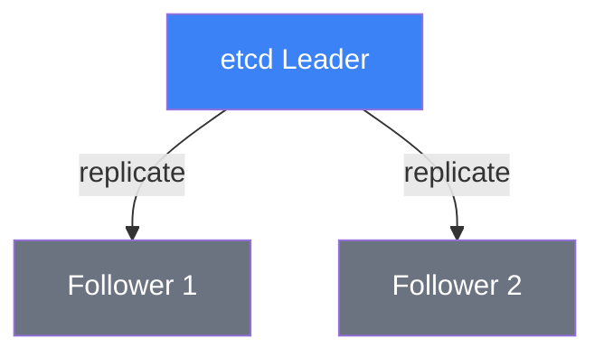

# 17.2 etcd — The Cluster Brain

⏱️ **~8 min read**

> **TL;DR:** etcd is a distributed key-value store that holds *all* cluster state. If etcd disappears, your cluster freezes. If etcd corrupts, your cluster is gone. Understanding it builds appropriate respect — and good backup habits.

---

## What etcd Is

**etcd** is a distributed, strongly-consistent key-value store based on the **Raft consensus algorithm**. Kubernetes uses it as its sole persistent storage layer.

Every resource you've ever created — Pods, Deployments, Services, Secrets, RBAC rules — lives as a JSON blob in etcd. The API server is essentially an opinionated CRUD interface on top of it.



> 📝 **Note:** Only the API server talks to etcd. No other component (scheduler, kubelet, controller) has direct etcd access. This is intentional — the API server is the single bottleneck that enforces consistency.

---

## What's Actually Stored in etcd

All K8s data is stored under the `/registry/` prefix:

```
/registry/pods/default/my-pod
/registry/deployments/default/my-deployment
/registry/services/default/my-service
/registry/secrets/default/my-secret
/registry/configmaps/kube-system/kube-proxy
```

### Try It — Read etcd Directly

```bash
# SSH into the minikube node (runs etcd)
minikube ssh

# List all keys (requires etcd client)
sudo docker exec -it $(sudo docker ps | grep etcd | awk '{print $1}') \
  etcdctl \
  --endpoints=https://127.0.0.1:2379 \
  --cacert=/var/lib/minikube/certs/etcd/ca.crt \
  --cert=/var/lib/minikube/certs/etcd/healthcheck-client.crt \
  --key=/var/lib/minikube/certs/etcd/healthcheck-client.key \
  get / --prefix --keys-only | head -30
```

**Expected output:**
```
/registry/clusterrolebindings/cluster-admin
/registry/clusterroles/admin
/registry/configmaps/kube-system/extension-apiserver-authentication
/registry/deployments/kube-system/coredns
/registry/namespaces/default
/registry/pods/kube-system/coredns-5d78c9869d-wr2vg
...
```

---

## Raft Consensus — Why etcd Is Reliable

etcd runs as an **odd-numbered cluster** (typically 3 or 5 nodes in production). Raft requires a **quorum** — a majority of nodes must agree before a write is committed.



| Cluster Size | Quorum | Can Tolerate |
|---|---|---|
| 1 node | 1 | 0 failures |
| 3 nodes | 2 | 1 failure |
| 5 nodes | 3 | 2 failures |

> ⚠️ **Warning:** Single-node etcd (like Minikube) has zero fault tolerance. Fine for learning — never for production.

### How a Write Works

1. Client sends write to the **leader**
2. Leader appends to its log and sends to all followers
3. When a **quorum** of followers acknowledge, the write is **committed**
4. Leader responds to client with success
5. All followers apply the committed entry to their state machine

This is why `kubectl apply` feels slightly slow — it's waiting for distributed consensus, not just a single disk write.

---

## Watch Mechanism — How Components Stay Up-to-Date

Components don't poll etcd constantly. Instead, they use the API server's **watch** mechanism:

```bash
# You can watch just like the scheduler does
kubectl get pods --watch

# Under the hood, this is a long-lived HTTP GET with chunked encoding
# The API server sends events as etcd writes happen
```

Every `kubectl get -w` command opens a long-lived HTTP connection. The API server streams change events from etcd to all watchers in real-time. This is the heartbeat of the Kubernetes control loop.

---

## Backup and Disaster Recovery

In production, etcd snapshots are your most important backups.

```bash
# Take an etcd snapshot (run inside the etcd pod/node)
etcdctl snapshot save /tmp/etcd-backup-$(date +%Y%m%d).db \
  --endpoints=https://127.0.0.1:2379 \
  --cacert=/etc/kubernetes/pki/etcd/ca.crt \
  --cert=/etc/kubernetes/pki/etcd/healthcheck-client.crt \
  --key=/etc/kubernetes/pki/etcd/healthcheck-client.key

# Verify the snapshot
etcdctl snapshot status /tmp/etcd-backup.db --write-out=table
```

**Expected output:**
```
+----------+----------+------------+------------+
|   HASH   | REVISION | TOTAL KEYS | TOTAL SIZE |
+----------+----------+------------+------------+
| a9b3f2c1 |    18472 |        512 |     3.1 MB |
+----------+----------+------------+------------+
```

> 🏭 **In Production:** Managed services (EKS, GKE, AKS) handle etcd backup automatically. Self-managed clusters (kubeadm) need an etcd backup cronjob. Losing etcd without a backup = losing the entire cluster state.

---

## etcd vs. Application Databases

| | etcd | PostgreSQL/MySQL |
|---|---|---|
| Purpose | Cluster metadata | Application data |
| Data size | Small (< 8GB recommended) | Can be terabytes |
| Write rate | Low (hundreds/s) | High (thousands/s) |
| Consistency | Strong (linearizable) | Configurable |
| Used for | K8s objects | Your app's business data |

> ⚠️ **Warning:** Never use etcd as a general-purpose database for your applications. It's sized and optimized for cluster metadata only. Kubernetes will warn you if etcd size exceeds 2GB.

---

## Key Takeaways

| # | Concept | One-liner |
|---|---|---|
| 1 | etcd is the only truth | All cluster state lives here; API server is just the front door |
| 2 | Only API server writes to etcd | Direct access is possible but a dangerous anti-pattern |
| 3 | Raft needs a quorum | An even-split cluster (2/4 nodes) goes read-only |
| 4 | Watch is the real-time bus | Components subscribe to changes; polling is rare and expensive |
| 5 | Backup etcd or lose everything | No other backup will restore your cluster state |

---

## ✅ Quick Check

**Q1:** You have a 5-node etcd cluster. 3 nodes go down simultaneously. What happens?

<details>
<summary>Answer</summary>
The cluster loses quorum (needs 3/5 but only has 2). etcd becomes read-only — existing data is preserved but no new writes are accepted. The API server will reject any mutating requests (create, update, delete) but still serve reads from the cached state.
</details>

**Q2:** A developer claims "my deployment must have been lost because the API server crashed." Is this possible? Why or why not?

<details>
<summary>Answer</summary>
No. Once the API server acknowledges a create/update, the data is durably written to etcd. An API server crash after acknowledgment doesn't lose data. The developer's deployment is safe in etcd. What they might be experiencing is the API server not responding to status queries during the crash window.
</details>

**Q3:** You `kubectl apply` a Secret. Is it now encrypted in etcd?

<details>
<summary>Answer</summary>
By default, NO. Secrets in etcd are base64-encoded (not encrypted) unless you've configured "Encryption at Rest" (`EncryptionConfiguration` on the API server). This is a critical security gap in many clusters. Always enable etcd encryption for Secrets in production, or use an external secret manager like HashiCorp Vault.
</details>
