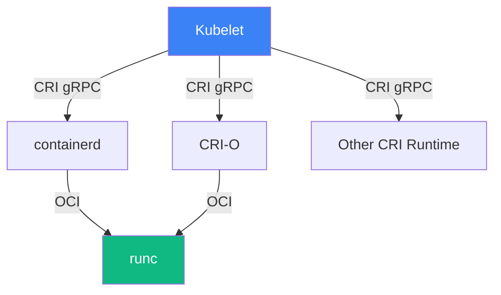
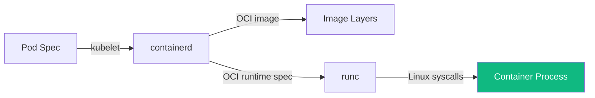

# 17.3 Container Runtimes and the CRI

⏱️ **6 min read · 5 min hands-on** · 🔴 Advanced

> **TL;DR:** Kubernetes doesn't run containers itself — it delegates to a **Container Runtime** via the **CRI (Container Runtime Interface)**. Docker, containerd, and CRI-O are all valid runtimes; K8s doesn't care which one you use.

> **After this section you will be able to:**
> - Understand the Container Runtime Interface (CRI) gRPC architecture
> - Compare high-level runtimes (containerd, CRI-O) with low-level runtimes (runc, crun, gVisor)
> - Debug container sandboxes and images using the `crictl` CLI

---

## The Abstraction Layer

Early Kubernetes had Docker hardcoded into the kubelet. This was messy — every Docker release could break K8s. The solution was the **Container Runtime Interface (CRI)**: a gRPC API that any runtime can implement.



| Layer | What it is | Examples |
|---|---|---|
| **CRI** | The API standard | gRPC interface (ImageService + RuntimeService) |
| **High-level runtime** | Implements CRI | containerd, CRI-O |
| **Low-level runtime** | Actually creates containers | runc, crun, kata-containers |
| **OCI spec** | Container format standard | What `runc` implements |

---

## What Happened to Docker?

Kubernetes **removed the Dockershim** in v1.24. Docker is no longer a supported runtime for K8s worker nodes.

This confused many people — let's be clear about what changed and what didn't:

| | Before v1.24 | After v1.24 |
|---|---|---|
| K8s worker runtime | Docker (via dockershim) | containerd or CRI-O |
| Your Docker images | Still work | Still work |
| `docker build` | Works | Works |
| `docker push` | Works | Works |
| Docker *as the kubelet runtime* | Supported | ❌ Removed |

> 💡 **Tip:** Your `Dockerfile` and `docker build` workflows are completely unaffected. The change only affects what runs *inside* the Kubernetes node. Images built with Docker follow the OCI spec and run fine under containerd.

---

## What containerd Does

**containerd** is the runtime used by Minikube, most managed K8s services (EKS, GKE, AKS), and the majority of self-managed clusters.

The kubelet calls containerd via CRI to:

```
1. Pull image         → ImageService.PullImage()
2. Create sandbox     → RuntimeService.RunPodSandbox()
3. Create container   → RuntimeService.CreateContainer()
4. Start container    → RuntimeService.StartContainer()
5. Execute in container → RuntimeService.ExecSync()
6. Stop container     → RuntimeService.StopContainer()
7. Remove container   → RuntimeService.RemoveContainer()
```

### Try It — Inspect containerd Directly

```bash
# SSH into the minikube node
minikube ssh

# List all containerd containers (ctr is the containerd CLI)
sudo ctr -n k8s.io containers list | head -20
```

**Expected output:**
```
CONTAINER                                                           IMAGE                                          RUNTIME
0a3b4f5c6d...   registry.k8s.io/pause:3.9                         io.containerd.runc.v2
1b2c3d4e5f...   docker.io/library/nginx:1.25                      io.containerd.runc.v2
...
```

```bash
# List running tasks (actual processes)
sudo ctr -n k8s.io tasks list | head -10
```

---

## The OCI Standard

The **Open Container Initiative (OCI)** defines two specs:
- **Image Spec** — how container images are structured (layers, manifests)
- **Runtime Spec** — how to run a container from an image (`config.json`)

**runc** is the reference implementation of the OCI Runtime Spec. It's what actually calls `clone()`, `chroot()`, and `cgroup` syscalls to create an isolated process.



### What runc Actually Does

When runc starts a container, it:
1. Creates a **new network namespace** (or joins the pod's existing one)
2. Creates a **new PID namespace**
3. Creates a **new mount namespace** (the container filesystem)
4. Sets up **cgroups** for resource limits (CPU, memory)
5. Applies **seccomp** and **AppArmor** profiles
6. Runs the container's entrypoint process as PID 1 in that namespace

---

## Alternative Runtimes

| Runtime | Description | Use Case |
|---|---|---|
| **containerd** | Industry standard, used everywhere | Default for most clusters |
| **CRI-O** | Lightweight, designed for K8s only | Red Hat / OpenShift clusters |
| **kata-containers** | VMs as containers (stronger isolation) | Multi-tenant, untrusted workloads |
| **gVisor** | Userspace kernel (Google's runsc) | Extra sandboxing for security |

> 🏭 **In Production:** Almost everyone uses containerd. CRI-O is popular in OpenShift environments. kata-containers and gVisor are used by cloud providers for their "serverless container" products (AWS Fargate, Google Cloud Run).

---

## Inspecting the Runtime from Kubernetes

You don't need to SSH into nodes. `crictl` is a CRI-compatible CLI available on the node:

```bash
minikube ssh

# crictl talks directly to the CRI socket
sudo crictl ps | head -10
```

**Expected output:**
```
CONTAINER    IMAGE                     CREATED       STATE    NAME
a3b4c5d6e   nginx@sha256:abc...       2 hours ago   Running  nginx
f1e2d3c4b   pause@sha256:123...       2 hours ago   Running  POD
...
```

```bash
# Inspect a container
sudo crictl inspect <container-id>

# Get container logs
sudo crictl logs <container-id>

# List images
sudo crictl images
```

---

## Key Takeaways

| # | Concept | One-liner |
|---|---|---|
| 1 | CRI decouples kubelet from runtime | K8s defines the API; runtimes implement it |
| 2 | Docker images still work | The image format (OCI) is unchanged; only the node runtime changed |
| 3 | containerd is the default | EKS, GKE, AKS, Minikube all use it |
| 4 | runc does the real work | containerd calls runc which calls Linux kernel APIs |
| 5 | crictl is your node-level kubectl | Use it to debug container issues the kubelet can't explain |

---

## ✅ Quick Check

**Q1:** Your team just upgraded from Kubernetes v1.23 to v1.25. The upgrade guide says you must migrate from Docker to containerd. Does this break your existing container images?

<details>
<summary>Answer</summary>
No. Container images follow the OCI Image Spec regardless of which tool built them. Docker builds OCI-compliant images. containerd runs OCI-compliant images. Your images will run identically under containerd. Only the node-level runtime changes; your image workflow and Dockerfiles remain the same.
</details>

**Q2:** A pod is in `ContainerCreating` state for 10 minutes. The kubelet events show "failed to pull image." Which component is actually failing — the CRI or runc?

<details>
<summary>Answer</summary>
The CRI (containerd/CRI-O) — specifically its ImageService. Image pulling happens before runc is involved. runc only gets called once the image is present locally. Check for network issues, authentication problems with the registry, or an incorrect image name/tag.
</details>

**Q3:** You need to run untrusted, multi-tenant workloads on a shared K8s cluster. Standard containers won't cut it from a security standpoint. What runtime would you investigate?

<details>
<summary>Answer</summary>
kata-containers or gVisor (runsc). Both provide stronger isolation — kata-containers runs each pod in a lightweight VM, while gVisor intercepts syscalls via a user-space kernel. Both implement the OCI Runtime Spec so they're compatible with containerd as a shim.
</details>
