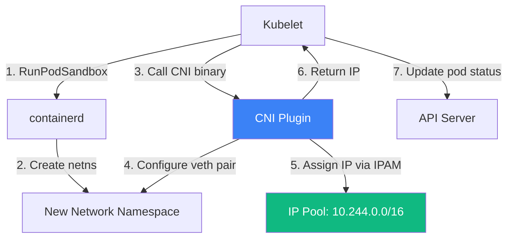
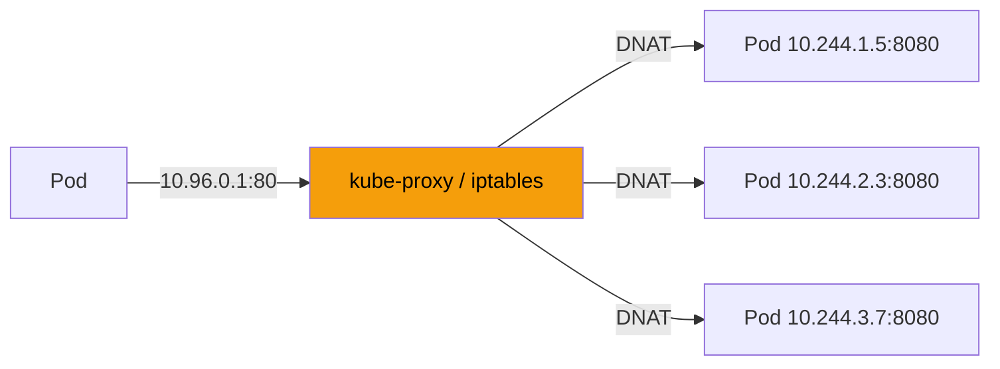

# 17.4 CNI — Container Network Interface

⏱️ **6 min read · 5 min hands-on** · 🔴 Advanced

> **TL;DR:** Every pod gets a real IP address. The **CNI (Container Network Interface)** plugin is responsible for assigning that IP and setting up routes so pods on different nodes can talk to each other. Kubernetes defines the interface; plugins like Flannel, Calico, and Cilium implement it.

> **After this section you will be able to:**
> - Explain the Container Network Interface (CNI) standard and pod IP assignment mechanisms
> - Compare overlay network implementations (Flannel VXLAN) with eBPF/routed networks (Calico, Cilium)
> - Inspect virtual ethernet pairs (`veth`), network namespaces, and bridge interfaces on nodes

---

## The Problem CNI Solves

The Kubernetes networking model has three fundamental requirements:

1. **Every pod gets its own unique IP** — no port mapping tricks
2. **Pods on the same node can reach each other directly**
3. **Pods on different nodes can reach each other directly** (without NAT)

This is harder than it sounds. Physically, your nodes are separate machines on a network. Pods need IPs that look like they're on one flat network. CNI plugins bridge this gap.

---

## How CNI Works

CNI is a **specification + library** (not a daemon). When the kubelet needs to set up networking for a new pod, it:

1. Creates the pod sandbox (pause container with a new network namespace)
2. Calls the CNI plugin binary with the pod's network namespace path
3. The CNI plugin configures the interface inside the namespace
4. The plugin assigns an IP from its IPAM (IP Address Management) pool
5. Returns the IP to the kubelet



---

## The veth Pair Trick

CNI plugins typically use **virtual ethernet pairs (veth)** to connect pod namespaces to the node network:

```
Pod Namespace                 Node Namespace (root)
┌────────────────┐           ┌─────────────────────────┐
│  eth0          │◄─────────►│  veth0a3b4c              │
│  10.244.1.5/24 │  veth pair│  (appears as host nic)   │
└────────────────┘           │                          │
                             │  cbr0 (bridge)            │
                             │  10.244.1.0/24            │
                             └─────────────────────────┘
```

Think of veth pairs as a **pipe**: packets in one end come out the other. One end lives inside the pod namespace (`eth0`); the other lives on the host (`vethXXXXXX`). The host side connects to a bridge interface that routes traffic between pods on the same node.

### Try It — See the veth Pairs

```bash
minikube ssh

# List all veth interfaces on the node
ip link show type veth
```

**Expected output:**
```
4: veth1a2b3c@if3: <BROADCAST,MULTICAST,UP,LOWER_UP> mtu 1450 qdisc noqueue
    master cni0 state UP mode DEFAULT group default
6: veth4d5e6f@if3: <BROADCAST,MULTICAST,UP,LOWER_UP> mtu 1450 qdisc noqueue
    master cni0 state UP mode DEFAULT group default
```

Each `vethXXX` corresponds to one running pod.

---

## Cross-Node Networking

Same-node pod-to-pod communication is easy (bridge + veth). Cross-node is harder. CNI plugins solve this in different ways:

| Plugin | Cross-Node Method | Overhead |
|---|---|---|
| **Flannel** | VXLAN overlay (tunnel) | Moderate (encapsulation) |
| **Calico** | BGP routing (no overlay) | Low (native routing) |
| **Cilium** | eBPF-based dataplane | Very low + observability bonus |
| **Weave** | Mesh network | Moderate |

### Overlay vs. Underlay

**Overlay networks (Flannel VXLAN):**
```
Pod-A (Node 1) → veth → bridge → VXLAN tunnel → bridge → veth → Pod-B (Node 2)
```
- Works everywhere — doesn't require router cooperation
- Adds overhead: every packet is wrapped in a UDP envelope

**BGP routing (Calico):**
```
Pod-A (Node 1) → veth → bridge → Node 1 routes to Node 2 → bridge → veth → Pod-B (Node 2)
```
- No encapsulation overhead
- Requires the underlying network to support BGP
- Better performance

---

## Popular CNI Plugins

### Flannel (Minikube Default)

Simple, reliable, easy to set up. Uses VXLAN by default. No network policy support (needs Calico to add policies on top).

```bash
# See Flannel running on Minikube
kubectl get pods -n kube-flannel
```

### Calico

Production-grade. BGP routing, full NetworkPolicy support, can replace kube-proxy for advanced use cases.

### Cilium

The newest and most powerful. Uses **eBPF** (extended Berkeley Packet Filter) to process packets at the kernel level — no iptables overhead.

Additional features:
- **Hubble** — built-in network observability and flow visualization
- **mTLS** between pods without service mesh overhead
- Layer 7 network policies (HTTP path/method aware)

> 🏭 **In Production:** GKE uses Dataplane V2 (based on Cilium). EKS offers AWS VPC CNI (pods get VPC IPs). Most self-managed clusters use Calico or Cilium.

---

## Services and kube-proxy

CNI handles pod-to-pod networking. **kube-proxy** handles Service VIPs (ClusterIP):



kube-proxy watches Services and Endpoints, then programs iptables rules (or IPVS) to redirect traffic from the Service ClusterIP to one of the backing pod IPs.

```bash
# See kube-proxy rules (on the node)
minikube ssh
sudo iptables -t nat -L KUBE-SERVICES | head -20
```

---

## Key Takeaways

| # | Concept | One-liner |
|---|---|---|
| 1 | CNI is a spec, not a product | Kubelet calls a binary; the plugin does the real work |
| 2 | veth pairs connect pod namespaces | One end in the pod, one on the host, bridged together |
| 3 | Cross-node: overlay vs. BGP | Overlay works anywhere; BGP is faster if the network allows it |
| 4 | kube-proxy handles Services | ClusterIP magic is iptables/IPVS rules, not real IPs |
| 5 | Cilium/eBPF is the future | Better performance, built-in observability, no iptables |

---

## ✅ Quick Check

**Q1:** You deploy 10 pods. How many veth interfaces appear on the node (assuming single-node Minikube)?

<details>
<summary>Answer</summary>
20 — each pod gets one veth pair (two interfaces). One end is inside the pod namespace (visible as `eth0` inside the pod), the other end is on the host (visible as `vethXXXXXX`). So 10 pods × 2 interfaces = 20, but typically you only see the 10 host-side interfaces with `ip link show type veth`.
</details>

**Q2:** A NetworkPolicy blocks traffic between namespaces. Is this enforced by CNI, kube-proxy, or the API server?

<details>
<summary>Answer</summary>
By the CNI plugin — but only if your CNI supports NetworkPolicy (Flannel alone does NOT; you need Calico, Cilium, or similar). The API server validates and stores the policy. The CNI plugin reads the policy and programs the actual enforcement (iptables rules, eBPF programs, etc.). kube-proxy is not involved in NetworkPolicy enforcement.
</details>

**Q3:** You notice pod-to-pod latency increased by ~0.5ms after switching CNI plugins. What's the most likely cause?

<details>
<summary>Answer</summary>
The new CNI likely uses VXLAN overlay encapsulation (like Flannel) while the old one used native BGP routing (like Calico). Overlay networks add packet encapsulation/decapsulation overhead on every hop. Solutions: switch back to a non-overlay CNI, or use Cilium with eBPF for minimal-overhead networking.
</details>
