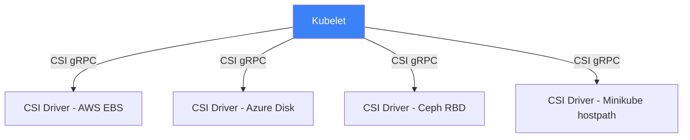
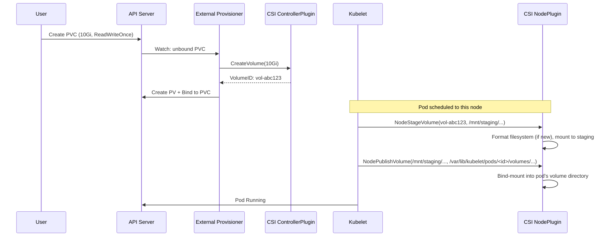

# 17.5 CSI — Container Storage Interface

⏱️ **~6 min read**

> **TL;DR:** The **CSI (Container Storage Interface)** is to storage what CRI is to containers and CNI is to networking — a standard plugin API so Kubernetes doesn't need to know about every cloud provider's disk implementation.

---

## Why CSI Exists

Before CSI, Kubernetes had in-tree volume plugins — code for AWS EBS, GCE PD, Azure Disk, Ceph, etc. was compiled *directly into Kubernetes*. Every cloud provider had to send PRs to the core K8s repo to add or update their volume driver.

CSI (standardized in K8s 1.13) moved all volume implementations out-of-tree into separate plugins:



---

## The CSI Architecture

A CSI driver runs as a set of pods in your cluster, implementing a standard gRPC interface:

| gRPC Service | Responsibility |
|---|---|
| **IdentityServer** | Report driver capabilities to K8s |
| **ControllerServer** | Create/delete/attach/detach volumes (cloud API calls) |
| **NodeServer** | Mount/unmount volumes on the specific node |

```
PVC Created
    ↓
External-Provisioner (sidecar) → CSI ControllerServer.CreateVolume()
                                    → Cloud API: aws ec2 create-volume
    ↓
Volume attached to node
    ↓
Kubelet → CSI NodeServer.NodeStageVolume()  (format, mount to staging path)
        → CSI NodeServer.NodePublishVolume() (bind-mount into pod)
    ↓
Pod sees /data directory
```

---

## The Flow: From PVC to Mounted Directory



### Try It — See CSI Drivers in Minikube

```bash
# Minikube uses the hostpath CSI driver by default
kubectl get csidrivers
```

**Expected output:**
```
NAME                  ATTACHREQUIRED   PODINFOONMOUNT   STORAGECAPACITY   ...
driver.longhornio     false            false            false
hostpath.csi.k8s.io   false            true             false
```

```bash
# See the CSI driver pods
kubectl get pods -n kube-system | grep csi
```

---

## Common CSI Drivers

| CSI Driver | Provider | Storage Type |
|---|---|---|
| `ebs.csi.aws.com` | AWS | EBS volumes |
| `disk.csi.azure.com` | Azure | Managed Disks |
| `pd.csi.storage.gke.io` | GCP | Persistent Disks |
| `rbd.csi.ceph.com` | Ceph | Block storage |
| `nfs.csi.k8s.io` | NFS | Network file system |
| `hostpath.csi.k8s.io` | Local | Local disk (dev/testing) |
| `driver.longhorn.io` | Longhorn | Distributed block storage (self-hosted) |

---

## Volume Lifecycle Operations

CSI supports more operations than just "mount disk":

| Operation | What it does |
|---|---|
| **CreateVolume** | Provision a new volume in the cloud |
| **DeleteVolume** | Delete the volume when PV is reclaimed |
| **ControllerPublishVolume** | Attach disk to specific VM (AWS: attach EBS) |
| **ControllerUnpublishVolume** | Detach disk from VM |
| **NodeStageVolume** | Format + mount to a node-global staging path |
| **NodePublishVolume** | Bind-mount from staging into the pod |
| **CreateSnapshot** | Take a point-in-time snapshot |
| **RestoreSnapshot** | Create a volume from a snapshot |
| **ExpandVolume** | Resize the volume (increase PVC size) |

### Try It — Resize a PVC (if StorageClass allows)

```bash
# Check if the StorageClass allows expansion
kubectl get storageclass standard -o yaml | grep allowVolumeExpansion
```

```bash
# Expand a PVC by editing its size
kubectl patch pvc my-pvc -p '{"spec":{"resources":{"requests":{"storage":"20Gi"}}}}'

# Watch the resize happen
kubectl get pvc my-pvc -w
```

---

## CSI vs. In-Tree Volumes

Some volume types like `emptyDir`, `configMap`, and `secret` are still "in-tree" — they don't use CSI because they're managed entirely by the kubelet without any external API calls.

| Volume Type | Implementation | Example |
|---|---|---|
| `emptyDir` | In-tree (kubelet) | Temporary pod scratch space |
| `configMap`, `secret` | In-tree (kubelet) | Projected into pod filesystem |
| `hostPath` | In-tree (kubelet) | Direct node path mount |
| `persistentVolumeClaim` | CSI (for dynamic) | Cloud disks, NFS, Ceph |

> ⚠️ **Warning:** `hostPath` volumes are dangerous in production — they mount the real node filesystem. A bug in your app can damage the node. Use them only for DaemonSets that genuinely need node-level access (e.g., log collection agents).

---

## Key Takeaways

| # | Concept | One-liner |
|---|---|---|
| 1 | CSI = plugin standard for storage | Cloud providers ship their own CSI driver; K8s calls the standard API |
| 2 | Two plugins: Controller + Node | Controller talks to the cloud API; Node mounts on the specific machine |
| 3 | PVC binding triggers provisioning | When a PVC is created, the External Provisioner calls CreateVolume |
| 4 | Snapshots are a CSI feature | PVC snapshots are standardized — VolumeSnapshot CRDs in K8s 1.20+ |
| 5 | hostPath is in-tree and risky | Use it only when you must access the actual node filesystem |

---

## ✅ Quick Check

**Q1:** You set `persistentVolumeReclaimPolicy: Retain` on a PV. A user deletes the PVC. What does the CSI driver do with the actual cloud disk?

<details>
<summary>Answer</summary>
Nothing — the disk is preserved. The PV moves to "Released" status, and the cloud disk remains allocated (and you'll keep paying for it). Retain means the cluster administrator must manually delete the disk when they're done. Compare with Delete policy, where the CSI driver calls DeleteVolume() automatically when the PVC is deleted.
</details>

**Q2:** A pod is stuck in `ContainerCreating` with the event "MountVolume.MountDevice failed." Which CSI operation is failing?

<details>
<summary>Answer</summary>
NodeStageVolume — this is where the device is formatted and mounted to the node's staging path. Possible causes: the underlying volume is already attached to another node (ReadWriteOnce constraint), filesystem errors, or the CSI node plugin pod is crashed. Check the CSI node plugin logs: `kubectl logs -n kube-system -l app=csi-node-driver`.
</details>

**Q3:** Your team wants to take consistent hourly snapshots of a database PVC on EKS. What's the Kubernetes-native way to do this?

<details>
<summary>Answer</summary>
Use VolumeSnapshots with a VolumeSnapshotClass pointing to the EBS CSI driver. Create a CronJob that creates VolumeSnapshot objects on a schedule. The EBS CSI driver handles the actual snapshot via the AWS EBS API. This is more reliable than scripting `aws ec2 create-snapshot` because it's coordinated through the same lifecycle management K8s uses for all storage operations.
</details>
