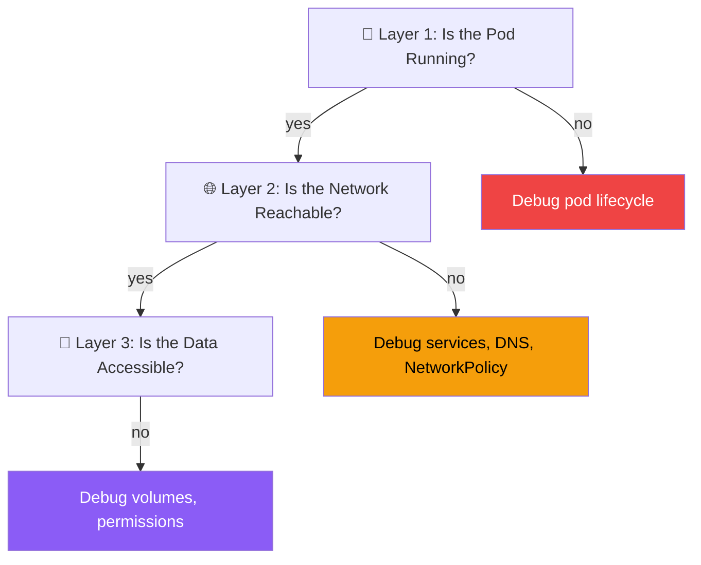

# 18.1 The Debugging Mental Model

⏱️ **6 min read · 6 min hands-on** · 🔴 Advanced

> 📡 **Scenario:** A high-severity production outage alert wakes you up: the payment gateway service is returning HTTP 502 to all users. Panic sets in as team members randomly guess whether it's DNS, ingress, CPU limits, or code crashes.
>
> *After this section, you'll be able to isolate and resolve any Kubernetes outage systematically in under 10 minutes using a 3-layer diagnostic model.*

> **TL;DR:** Kubernetes debugging is systematic, not random. Follow a three-layer model: **Is the pod running? Is the network reachable? Is the data accessible?** Answer each layer in order before jumping to the next.

> **After this section you will be able to:**
> - Apply the 3-layer debugging framework (Pod level → Network level → Storage/Config level)
> - Execute universal diagnostic commands (`get`, `describe`, `logs`, `events`) in the correct sequence
> - Isolate failure domains quickly without guessing or making random destructive changes

---

## The Three-Layer Mental Model

Almost every Kubernetes problem falls into one of three layers:



Never skip a layer. If pods aren't running, there's no point debugging the service. If the service is broken, there's no point debugging the application logic.

---

## The Universal Debugging Sequence

When something is broken, always run these commands in order:

```bash
# Step 1: Get the overall picture
kubectl get pods -n <namespace>
kubectl get events -n <namespace> --sort-by='.lastTimestamp' | tail -20

# Step 2: Zoom into the broken pod
kubectl describe pod <pod-name> -n <namespace>

# Step 3: Read the container logs
kubectl logs <pod-name> -n <namespace>
kubectl logs <pod-name> -n <namespace> --previous  # logs from last crash

# Step 4: Get inside (if the pod is running but misbehaving)
kubectl exec -it <pod-name> -n <namespace> -- /bin/sh

# Step 5: Check related resources
kubectl describe service <svc-name> -n <namespace>
kubectl describe pvc <pvc-name> -n <namespace>
```

> 💡 **Tip:** `kubectl describe` is your best friend. The Events section at the bottom shows the timestamped history of what Kubernetes tried to do and where it failed.

---

## Reading `kubectl describe pod` — What to Look At

```bash
kubectl describe pod my-broken-pod
```

Here's what each section tells you:

```
Name:         my-broken-pod
Namespace:    default
Node:         minikube/192.168.49.2     ← which node it's on (empty if Pending)
Status:       Pending                   ← overall pod phase
Conditions:
  Initialized   True   ← init containers done
  Ready         False  ← is the pod serving traffic?
  PodScheduled  True   ← scheduler found a node

Events:
  Type     Reason            Age   From               Message
  ----     ------            ---   ----               -------
  Warning  FailedScheduling  5s    default-scheduler  0/1 nodes have enough memory
  Normal   Scheduled         4s    default-scheduler  assigned to minikube
  Normal   Pulling           3s    kubelet            Pulling image "myapp:v2"
  Warning  Failed            2s    kubelet            Failed to pull image: not found
```

The Events section reads like a log — newest at the bottom, problems labeled `Warning`. **Start here.**

---

## Using kubectl Events for Cluster-Wide Visibility

```bash
# All events in the cluster, sorted by time
kubectl get events --all-namespaces --sort-by='.lastTimestamp' | tail -30

# Only Warning events
kubectl get events --all-namespaces --field-selector type=Warning

# Watch events live
kubectl get events --watch
```

---

## The Ephemeral Debug Container

If a pod is running but has no shell (distroless images, scratch-based images), you can't `exec` into it. Use an **ephemeral debug container**:

```bash
# Inject a debug container into a running pod (K8s 1.23+)
kubectl debug -it <pod-name> --image=busybox:1.36 --target=<container-name>
```

This starts a `busybox` container in the same pod namespace — you get a shell that shares the same network and can see the same processes.

```bash
# Alternatively, copy the pod and add a debug sidecar
kubectl debug <pod-name> -it --copy-to=debug-pod --image=busybox:1.36
```

---

## Node-Level Debugging

When the problem is on the node itself (disk pressure, kubelet crash, etc.):

```bash
# Check node conditions
kubectl describe node minikube

# Look for these warning conditions:
#   MemoryPressure: True    → node is OOM, pods may be evicted
#   DiskPressure: True      → node disk is full, no new pods can start
#   PIDPressure: True       → too many processes
#   Ready: False            → kubelet is unhealthy
```

```bash
# SSH into the node to check kubelet logs
minikube ssh
sudo journalctl -u kubelet -f --since "5 min ago"
```

---

## Quick Reference: Status vs. What it Means

| Pod Status | Layer | Likely Cause |
|---|---|---|
| `Pending` | Layer 1 | Scheduling failed (resources, affinity, taints) |
| `ContainerCreating` | Layer 1 | Image pull, volume mount, or CNI setup |
| `CrashLoopBackOff` | Layer 1 | Container crashes immediately after start |
| `OOMKilled` | Layer 1 | Container exceeded memory limit |
| `ImagePullBackOff` | Layer 1 | Can't pull image (wrong name, auth, network) |
| `Running` but not `Ready` | Layer 2 | Readiness probe failing |
| `Running` but service 503 | Layer 2 | Service label selector mismatch |
| `Running` but can't read data | Layer 3 | Volume not mounted, wrong permissions |

---

## Key Takeaways

| # | Concept | One-liner |
|---|---|---|
| 1 | Debug in layers | Pod → Network → Storage; don't skip ahead |
| 2 | Events are your best signal | Always `kubectl describe` before reading logs |
| 3 | `--previous` for crash logs | The container that crashed is gone; use this flag |
| 4 | Ephemeral containers for distroless | Inject a shell without modifying the pod spec |
| 5 | Node conditions matter | MemoryPressure/DiskPressure can silently break everything |

---

## ✅ Quick Check

**Q1:** A pod is `Running` but your curl requests to its Service get `Connection refused`. In the three-layer model, which layer is broken, and what's your first debugging command?

<details>
<summary>Answer</summary>
Layer 2 — Network. The pod is up (Layer 1 is fine), but the service routing is broken. First command: `kubectl describe service SERVICE_NAME` to check if the Endpoints are populated. If Endpoints shows `(none)`, the label selector on the Service doesn't match the pod labels.
</details>

**Q2:** You run `kubectl logs my-pod` and get "Error from server (NotFound): pods 'my-pod' not found." But `kubectl get pods` shows the pod. What's likely happening?

<details>
<summary>Answer</summary>
The pod is in a different namespace. `kubectl logs` defaults to the `default` namespace. The pod is probably in another namespace. Try `kubectl logs my-pod -n NAMESPACE` or check all namespaces with `kubectl get pods --all-namespaces | grep my-pod`.
</details>

**Q3:** A pod based on a distroless image (`FROM scratch`) is misbehaving. You want to run `curl` from inside the pod to test connectivity. How do you get a shell?

<details>
<summary>Answer</summary>
Use an ephemeral debug container: `kubectl debug -it POD_NAME --image=curlimages/curl:latest --target=CONTAINER_NAME`. This injects a curl-enabled container into the same pod namespace without modifying or restarting the original pod.
</details>
