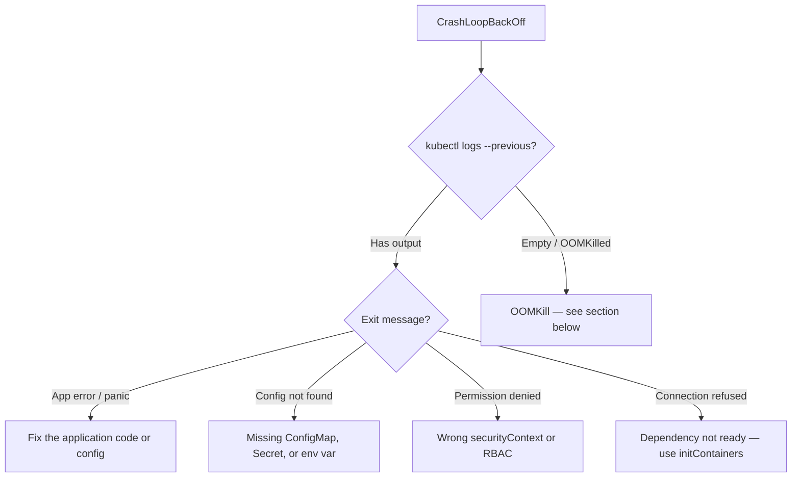

# 18.2 Pod Failures — CrashLoopBackOff, ImagePullBackOff, OOMKilled

⏱️ **7 min read · 8 min hands-on** · 🔴 Advanced

> **TL;DR:** The three most common pod failure modes each have a distinct fingerprint. Learn to recognize them immediately and drill straight to the cause.

> **After this section you will be able to:**
> - Diagnose and fix `CrashLoopBackOff` using exit codes and `kubectl logs --previous`
> - Resolve `ImagePullBackOff` and `ErrImagePull` due to missing tags or secret credentials
> - Identify and resolve `OOMKilled` (Exit Code 137) and resource CPU starvation issues

---

## Failure Mode 1: CrashLoopBackOff

**What it means:** Your container starts, crashes immediately, restarts, crashes again. Kubernetes backs off exponentially (10s → 20s → 40s → 5min cap) to avoid hammering the system.

```bash
kubectl get pods
```

```
NAME          READY   STATUS             RESTARTS   AGE
my-app-xxx    0/1     CrashLoopBackOff   8          12m
```

### Diagnosis Decision Tree



### Step 1 — Read the Crash Logs

```bash
# Current log (may be empty if crash is instant)
kubectl logs my-app-xxx

# Log from the PREVIOUS container run (before the restart)
kubectl logs my-app-xxx --previous
```

**Common log patterns:**

```
# Missing environment variable
Error: Required env var DB_URL is not set

# Wrong command/entrypoint
exec: "nonexistent-binary": executable file not found in $PATH

# Database connection refused
Error: dial tcp 10.96.100.5:5432: connect: connection refused

# Permission denied
Error: open /data/config.yaml: permission denied
```

### Step 2 — Check Exit Code

```bash
kubectl describe pod my-app-xxx | grep -A 5 "Last State"
```

```
Last State:     Terminated
  Reason:       Error
  Exit Code:    1          ← non-zero = app crashed
  Started:      ...
  Finished:     ...
```

| Exit Code | Meaning |
|---|---|
| `0` | Success (shouldn't CrashLoop if 0) |
| `1` | General application error |
| `127` | Command not found |
| `137` | OOMKilled (128 + SIGKILL signal 9) |
| `139` | Segfault (128 + SIGSEGV signal 11) |

### Common Fixes

```yaml
# Fix 1: Missing env var — add it
env:
  - name: DB_URL
    valueFrom:
      secretKeyRef:
        name: db-secret
        key: url

# Fix 2: Dependency not ready — add an init container
initContainers:
  - name: wait-for-db
    image: busybox:1.36
    command: ['sh', '-c', 'until nc -z db-service 5432; do sleep 2; done']
```

---

## Failure Mode 2: ImagePullBackOff / ErrImagePull

**What it means:** The kubelet tried to pull your container image and failed. Like CrashLoopBackOff, it backs off exponentially.

```bash
kubectl get pods
```

```
NAME          READY   STATUS             RESTARTS   AGE
my-app-xxx    0/1     ImagePullBackOff   0          5m
```

### Diagnosis

```bash
kubectl describe pod my-app-xxx | grep -A 10 "Events:"
```

```
Events:
  Warning  Failed  2m  kubelet  Failed to pull image "my-app:v99": rpc error:
                                 code = NotFound desc = failed to pull...
                                 404 Not Found
```

### Common Causes and Fixes

| Error Message | Cause | Fix |
|---|---|---|
| `not found` / `404` | Image tag doesn't exist | Check tag: `docker pull my-app:v99` locally |
| `unauthorized` / `403` | Registry auth failed | Create imagePullSecret |
| `name does not match` | Wrong registry/image name | Verify image path |
| `context deadline exceeded` | Network timeout | Check node DNS, registry reachability |

### Fixing Auth Issues with imagePullSecret

```bash
# Create a secret with registry credentials
kubectl create secret docker-registry regcred \
  --docker-server=ghcr.io \
  --docker-username=myuser \
  --docker-password=mytoken \
  --docker-email=me@example.com
```

```yaml
# Reference it in the pod spec
spec:
  imagePullSecrets:
    - name: regcred
  containers:
    - name: app
      image: ghcr.io/myuser/my-app:v1
```

### Quick Tag Verification

```bash
# Check if the image actually exists locally/remotely
docker pull my-app:v99  # try it locally first

# Or with crane (a registry inspection tool)
crane manifest my-app:v99
```

---

## Failure Mode 3: OOMKilled

**What it means:** Your container tried to use more memory than its `limits.memory` allows. The kernel's OOM killer sent SIGKILL (signal 9). Exit code will be **137**.

```bash
kubectl describe pod my-app-xxx | grep -A 10 "Last State"
```

```
Last State:     Terminated
  Reason:       OOMKilled
  Exit Code:    137
  Started:      ...
  Finished:     ...
```

### Diagnosis

```bash
# Check current memory usage
kubectl top pod my-app-xxx

# Check the limit
kubectl get pod my-app-xxx -o yaml | grep -A 5 resources
```

```yaml
resources:
  requests:
    memory: "128Mi"
  limits:
    memory: "256Mi"    ← if the app needs 512Mi, it'll be OOMKilled
```

### Fix Options

**Option 1 — Increase the limit** (if the usage is legitimate):

```yaml
resources:
  requests:
    memory: "256Mi"
  limits:
    memory: "512Mi"
```

**Option 2 — Fix the memory leak** (if usage should be lower):
- Profile the app with pprof (Go), jmap (Java), or memory_profiler (Python)
- Look for unbounded caches, missing connection pool limits, or request body not closed

**Option 3 — Enable GOMEMLIMIT (for Go apps)**:

```yaml
env:
  - name: GOMEMLIMIT
    value: "200MiB"   # tells Go's GC to be more aggressive before hitting the limit
```

> ⚠️ **Warning:** OOMKilled pods will restart and immediately get OOMKilled again if you don't fix the root cause. The RESTARTS count will climb. Don't just bump the limit without understanding why memory is growing.

---

## Failure Mode 4: Pending (No Suitable Node)

```bash
kubectl describe pod my-app-xxx | grep -A 5 Events
```

```
Events:
  Warning  FailedScheduling  30s  default-scheduler  
    0/1 nodes are available: 1 Insufficient memory.
```

Common causes:

| Event Message | Cause | Fix |
|---|---|---|
| `Insufficient memory` | Node doesn't have enough free memory | Reduce requests, add nodes, or evict other pods |
| `node(s) had taints that the pod didn't tolerate` | Taint mismatch | Add tolerations or remove taint |
| `node(s) didn't match node affinity` | Affinity too restrictive | Relax affinity rules |
| `persistentvolumeclaim "x" not found` | PVC doesn't exist | Create the PVC first |

---

## Key Takeaways

| # | Failure Mode | Fastest Diagnosis Command |
|---|---|---|
| 1 | CrashLoopBackOff | `kubectl logs --previous` + check exit code |
| 2 | ImagePullBackOff | `kubectl describe pod` → Events → pull error message |
| 3 | OOMKilled | `kubectl describe pod` → Last State → Reason: OOMKilled |
| 4 | Pending | `kubectl describe pod` → Events → FailedScheduling message |

---

## ✅ Quick Check

**Q1:** A pod exits with code 137. Is this a bug in your application code, or something Kubernetes did?

<details>
<summary>Answer</summary>
Something Kubernetes (and the Linux kernel) did — exit code 137 = 128 + 9 (SIGKILL). The kernel's OOM killer sent SIGKILL because the container exceeded its memory limit. Your app didn't crash on its own; it was killed externally. The fix is either increasing the memory limit or fixing a memory leak.
</details>

**Q2:** `kubectl logs my-pod --previous` returns nothing. The pod is in CrashLoopBackOff. What should you check next?

<details>
<summary>Answer</summary>
Empty logs usually mean the container started but crashed before writing any output, OR it was OOMKilled (the kernel kills it before stdout is flushed). Check `kubectl describe pod my-pod` → Last State → Reason. If Reason is OOMKilled, increase the memory limit. If it's Error with exit code 127, the entrypoint binary doesn't exist in the image.
</details>

**Q3:** Your pod is `ImagePullBackOff` on a private GitHub Container Registry image. The image definitely exists and you can pull it locally with `docker pull`. What's missing?

<details>
<summary>Answer</summary>
An `imagePullSecret`. Your local Docker is authenticated (credentials in `~/.docker/config.json`), but the Kubernetes node's containerd runtime doesn't have registry credentials. Create a `docker-registry` Secret with your ghcr.io credentials and reference it in the pod's `imagePullSecrets` field.
</details>
