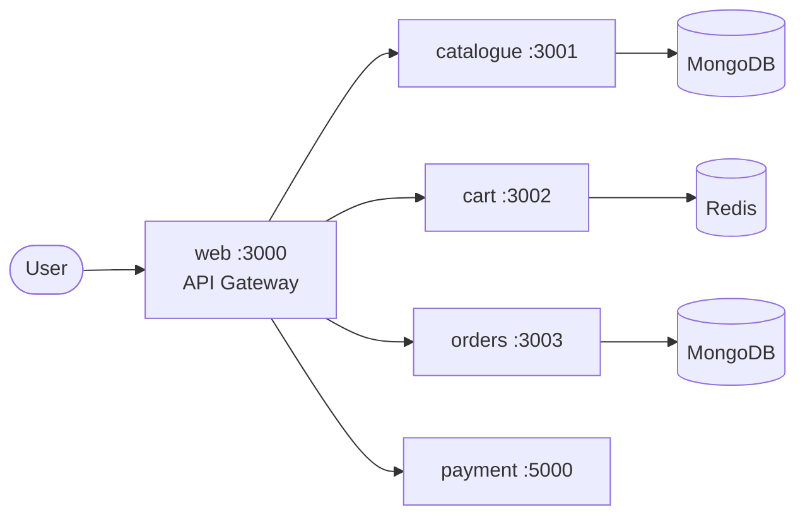

# Introduction

> You know Docker. You've written Compose files. You've built images, connected containers, and mounted volumes.
> Now your app needs to survive the real world — scaling, self-healing, zero-downtime deploys, secrets management, and multi-service coordination at scale.
> **That's what this book teaches.**

---

## What You'll Build

By the end of this book, you'll have deployed **KubeShop** — a five-service microservices e-commerce app — to both a local Minikube cluster and a production-grade Azure Kubernetes Service (AKS) cluster, complete with Helm packaging, autoscaling, RBAC, and a full CI/CD pipeline.



**The stack:** Node.js · Python · MongoDB · Redis · Docker · Kubernetes · Helm · GitHub Actions · ArgoCD · AKS

---

## Prerequisites

You need these before starting. Run the check commands — if they pass, you're good to go.

| Tool | Version | Check | Expected Output |
|------|---------|-------|-----------------|
| Docker | 20+ | `docker --version` | `Docker version 20.x...` |
| kubectl | 1.28+ | `kubectl version --client` | `Client Version: v1.28...` |
| Minikube | 1.32+ | `minikube version` | `minikube version: v1.3...` |
| Helm | 3.x | `helm version` | `version.BuildInfo{Version:"v3...` |
| Git | any | `git --version` | `git version 2...` |

> 💡 **Tip:** On Ubuntu/Debian, the quickest setup is:
> ```bash
> # kubectl
> curl -LO "https://dl.k8s.io/release/$(curl -L -s https://dl.k8s.io/release/stable.txt)/bin/linux/amd64/kubectl"
> sudo install -o root -g root -m 0755 kubectl /usr/local/bin/kubectl
>
> # minikube
> curl -LO https://storage.googleapis.com/minikube/releases/latest/minikube-linux-amd64
> sudo install minikube-linux-amd64 /usr/local/bin/minikube
>
> # helm
> curl https://raw.githubusercontent.com/helm/helm/main/scripts/get-helm-3 | bash
> ```

---

## How to Use This Book

Each chapter is designed to take **30–60 minutes** and ends with a hands-on lab. The pattern is always:

```
Concept (short) → Example (immediate) → Try it → Break it
```

- **Read linearly** if you're new to K8s.
- **Jump around** if you have experience — every section is self-contained.
- **Do the labs.** Reading about K8s is like reading about swimming. You have to get in the water.

> 🔥 **The "Break It!" philosophy:** The fastest way to understand a system is to watch it fail. Every chapter has intentional breakage exercises. Don't skip them.

---

## Chapter Roadmap

| # | Chapter | Time | You'll Be Able To |
|---|---------|------|-------------------|
| 1 | The Container Orchestration Problem | ~45 min | Explain why K8s exists and navigate a live cluster |
| 2 | kubectl — Your Swiss Army Knife | ~40 min | Query and control any K8s resource from the CLI |
| 3 | Pods — The Atomic Unit | ~50 min | Create, debug, and destroy pods with confidence |
| 4 | Workload Controllers | ~55 min | Deploy apps with zero-downtime rolling updates |
| 5 | Services | ~45 min | Connect pods across namespaces using DNS |
| 6 | Ingress — HTTP Routing | ~50 min | Route external traffic with NGINX and TLS |
| 7 | ConfigMaps and Secrets | ~40 min | Externalize config and manage sensitive data |
| 8 | Storage | ~45 min | Persist data across pod restarts |
| 9 | KubeShop Project | ~60 min | Containerize a real 5-service microservice app |
| 10 | Deploying KubeShop | ~60 min | Deploy a full microservices stack to Minikube |
| 11 | Health Checks & Self-Healing | ~45 min | Configure probes and run chaos experiments |
| 12 | Helm | ~55 min | Package and template K8s apps with Helm |
| 13 | Scheduling & Autoscaling | ~50 min | Autoscale under load and control pod placement |
| 14 | Security | ~55 min | Lock down a cluster with RBAC and Network Policies |
| 15 | Observability | ~60 min | Set up Prometheus, Grafana, and log aggregation |
| 16 | CI/CD with GitHub Actions | ~55 min | Build a full GitOps pipeline with ArgoCD |
| 17 | Azure Kubernetes Service | ~60 min | Deploy KubeShop to a production cloud cluster |
| 18 | K8s Internals | ~40 min | Explain what happens when you run `kubectl apply` |
| 19 | Troubleshooting Playbook | ~35 min | Debug any pod, network, or storage failure |

---

**Ready? Let's go to Chapter 1. →**
