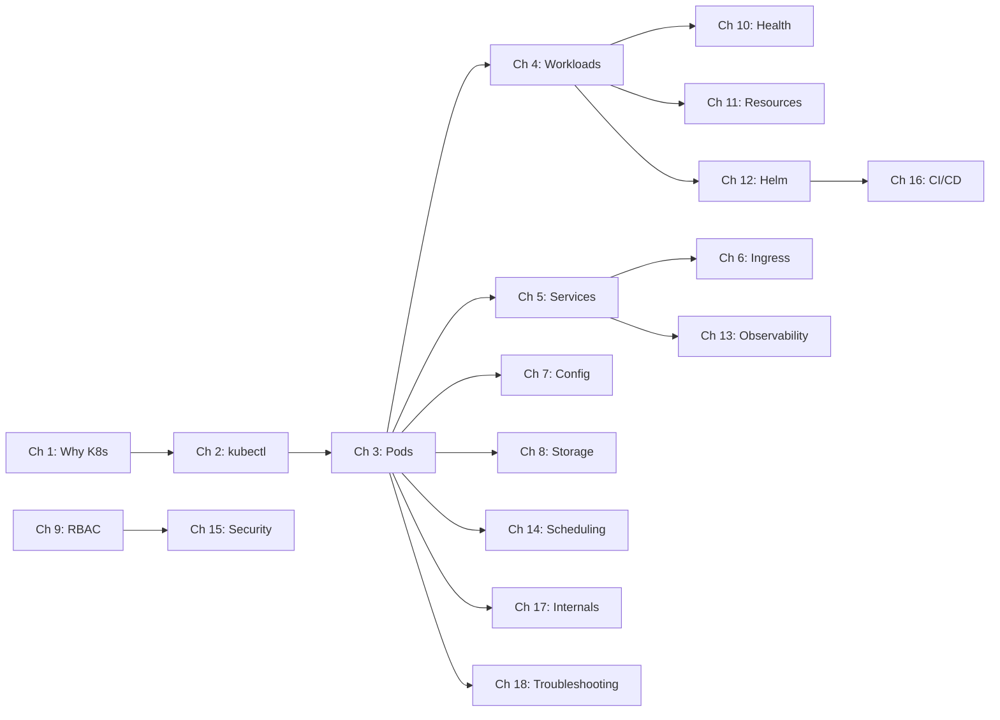

# Introduction

> You know Docker. You've written Compose files. You've built images, connected containers, and mounted volumes.  
> Now your app needs to survive the real world — scaling, self-healing, zero-downtime deploys, secrets management, and multi-service coordination at scale.  
> **That's what this book teaches.**

---

## What You'll Learn

By the end of this book, you'll understand every major Kubernetes concept — from Pods to production security and internals — through hands-on labs, real-world examples, and deliberate "break it" exercises that build genuine debugging intuition.

**The stack:** Docker · Kubernetes (v1.28+) · Minikube · Helm · Prometheus & Grafana · ArgoCD · GitHub Actions

---

## Prerequisites

You need these tools before starting. Run the check commands — if they pass, you're good to go.

| Tool | Version | Check | Expected Output |
|------|---------|-------|-----------------|
| Docker | 20+ | `docker --version` | `Docker version 20.x...` |
| kubectl | 1.28+ | `kubectl version --client` | `Client Version: v1.28...` |
| Minikube | 1.32+ | `minikube version` | `minikube version: v1.3...` |
| Helm | 3.x | `helm version` | `version.BuildInfo{Version:"v3...` |
| Git | any | `git --version` | `git version 2...` |

### Installation Guide

<details>
<summary>🐧 Linux (Ubuntu/Debian) Setup</summary>

```bash
# kubectl
curl -LO "https://dl.k8s.io/release/$(curl -L -s https://dl.k8s.io/release/stable.txt)/bin/linux/amd64/kubectl"
sudo install -o root -g root -m 0755 kubectl /usr/local/bin/kubectl

# minikube
curl -LO https://storage.googleapis.com/minikube/releases/latest/minikube-linux-amd64
sudo install minikube-linux-amd64 /usr/local/bin/minikube

# helm
curl https://raw.githubusercontent.com/helm/helm/main/scripts/get-helm-3 | bash
```
</details>

<details>
<summary>🍎 macOS Setup</summary>

Install the tools using Homebrew:

```bash
# Install kubectl, minikube, and helm
brew install kubectl minikube helm

# Ensure Docker Desktop is installed and running
brew install --cask docker
```

Start Minikube with the Docker driver:
```bash
minikube start --driver=docker
```
</details>

<details>
<summary>🪟 Windows (WSL2) Setup</summary>

Ensure WSL2 and Docker Desktop for Windows (with WSL2 integration enabled) are installed.

Install using Chocolatey (in PowerShell as Administrator) or directly inside your WSL2 terminal:

```powershell
# Chocolatey on Windows
choco install kubernetes-cli minikube kubernetes-helm
```

Or inside WSL2 (Ubuntu):
```bash
curl -LO "https://dl.k8s.io/release/$(curl -L -s https://dl.k8s.io/release/stable.txt)/bin/linux/amd64/kubectl"
sudo install -o root -g root -m 0755 kubectl /usr/local/bin/kubectl

curl -LO https://storage.googleapis.com/minikube/releases/latest/minikube-linux-amd64
sudo install minikube-linux-amd64 /usr/local/bin/minikube

curl https://raw.githubusercontent.com/helm/helm/main/scripts/get-helm-3 | bash
```
</details>

---

## Getting the Lab Files

Pre-built manifest YAML files for all hands-on exercises are available in the [`src/manifests/`](file:///home/vishvam.moliya@simform.dom/tasks/k8s/k8s-book/src/manifests) directory, organized by chapter. 

You can apply manifests directly from this directory during labs instead of manually copy-pasting code blocks:

```bash
# Example: Apply a manifest directly
kubectl apply -f src/manifests/ch03-pods/
```

---

## How to Use This Book

Each chapter is designed to take **30–60 minutes** and ends with a hands-on lab. The pattern is always:

```
Concept (short) → Example (immediate) → Try it → Break it
```

- **Read linearly** if you're new to Kubernetes.
- **Jump around** if you have experience — every section is self-contained.
- **Do the labs.** Reading about K8s is like reading about swimming. You have to get in the water.

> 🔥 **The "Break It!" philosophy:** The fastest way to understand a system is to watch it fail. Every chapter has intentional breakage exercises. Don't skip them.

### Chapter Dependency Map


```mermaid
graph LR
    CH1["Ch 1: Why K8s"] --> CH2["Ch 2: kubectl"]
    CH2 --> CH3["Ch 3: Pods"]
    CH3 --> CH4["Ch 4: Workloads"]
    CH3 --> CH5["Ch 5: Services"]
    CH5 --> CH6["Ch 6: Ingress"]
    CH3 --> CH7["Ch 7: Config"]
    CH3 --> CH8["Ch 8: Storage"]
    CH4 --> CH10["Ch 10: Health"]
    CH4 --> CH11["Ch 11: Resources"]
    CH4 --> CH12["Ch 12: Helm"]
    CH5 --> CH13["Ch 13: Observability"]
    CH3 --> CH14["Ch 14: Scheduling"]
    CH9["Ch 9: RBAC"] --> CH15["Ch 15: Security"]
    CH12 --> CH16["Ch 16: CI/CD"]
    CH3 --> CH17["Ch 17: Internals"]
    CH3 --> CH18["Ch 18: Troubleshooting"]
```

*Arrows indicate prerequisite relationships. If you're experienced with Kubernetes, use this graph to skip chapters you already know while ensuring you don't miss a dependency.*

---

## Chapter Roadmap

| # | Chapter | Time | You'll Be Able To |
|---|---------|------|-------------------|
| 1 | [The Container Orchestration Problem](./ch01-why-kubernetes/index.md) | ~45 min | Explain why K8s exists and navigate a live cluster |
| 2 | [kubectl — Your Swiss Army Knife](./ch02-kubectl/index.md) | ~40 min | Query and control any K8s resource from the CLI |
| 3 | [Pods — The Atomic Unit](./ch03-pods/index.md) | ~50 min | Create, debug, and destroy pods with confidence |
| 4 | [Workload Controllers](./ch04-workloads/index.md) | ~55 min | Deploy apps with zero-downtime rolling updates |
| 5 | [Services — Exposing Your Applications](./ch05-services/index.md) | ~45 min | Connect pods across namespaces using DNS |
| 6 | [Ingress — HTTP Routing](./ch06-ingress/index.md) | ~50 min | Route external traffic with NGINX, Gateway API, and TLS |
| 7 | [ConfigMaps and Secrets](./ch07-configuration/index.md) | ~40 min | Externalize config and manage sensitive data |
| 8 | [Storage — Persistent Data in K8s](./ch08-storage/index.md) | ~45 min | Persist data across pod restarts |
| 9 | [Namespaces, RBAC, and Multi-Tenancy](./ch09-rbac/index.md) | ~45 min | Partition clusters and enforce least privilege |
| 10 | [Health Checks and Graceful Shutdown](./ch10-health/index.md) | ~45 min | Configure probes and graceful termination |
| 11 | [Resource Management and Autoscaling](./ch11-resources/index.md) | ~50 min | Set requests/limits and autoscale pods & clusters |
| 12 | [Helm — Package Management](./ch12-helm/index.md) | ~55 min | Package, template, and manage releases with Helm & Kustomize |
| 13 | [Observability — Logging, Metrics, and Tracing](./ch13-observability/index.md) | ~60 min | Set up Prometheus, Grafana, and log aggregation |
| 14 | [Scheduling and Placement](./ch14-scheduling/index.md) | ~50 min | Control pod placement with affinity, taints, and tolerations |
| 15 | [Security Hardening](./ch15-security/index.md) | ~55 min | Lock down clusters with PSA, NetworkPolicies, and image scanning |
| 16 | [CI/CD and GitOps](./ch16-cicd/index.md) | ~55 min | Build automated delivery pipelines with GitHub Actions and ArgoCD |
| 17 | [Kubernetes Internals](./ch17-internals/index.md) | ~60 min | Deep dive into API machinery, etcd, CRI, CNI, and CSI |
| 18 | [Troubleshooting Playbook](./ch18-troubleshooting/index.md) | ~55 min | Systematic mental models and runbooks for any cluster failure |

---

**Ready? Let's go to Chapter 1. →**
